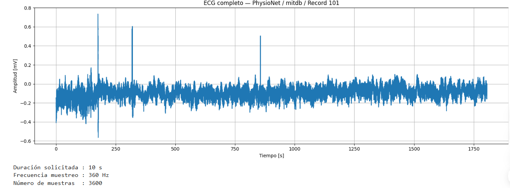
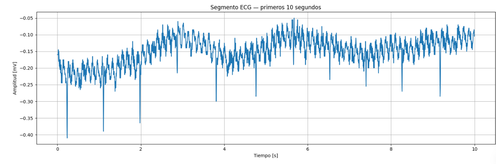
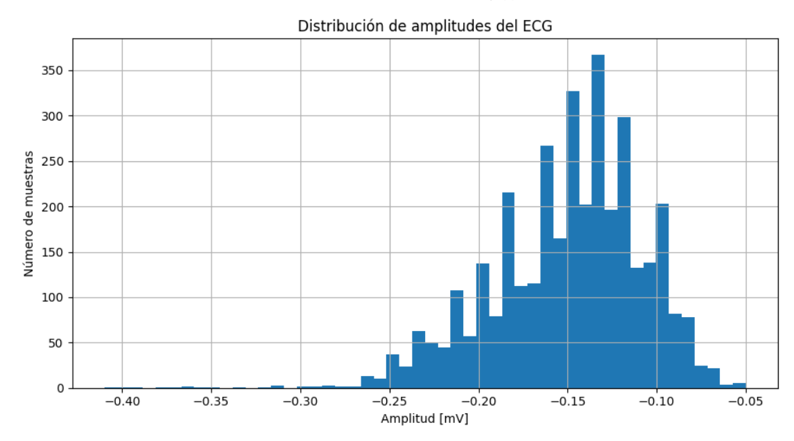
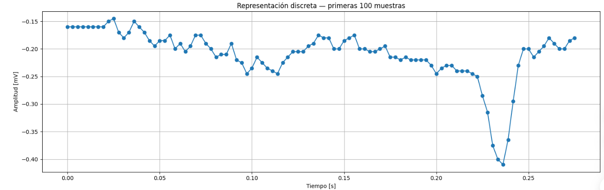
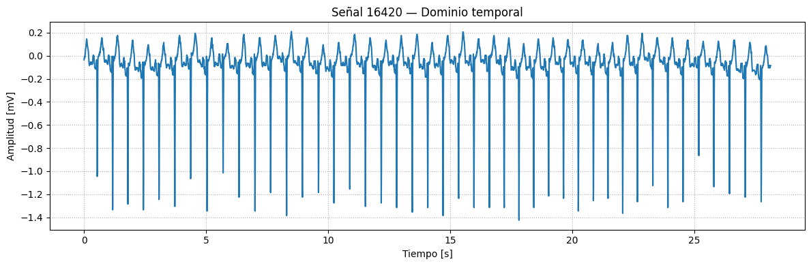
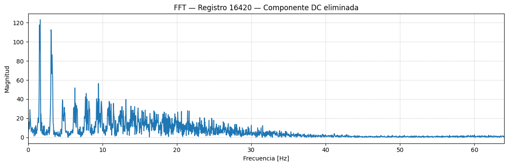
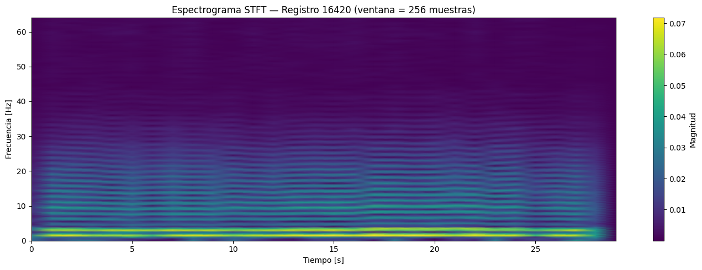

# Resumen de los 3 laboratorios
# Laboratorio 1: Introducción al análisis de señales biomédicas con PhysioNet

## Resumen

En este laboratorio se aprendió a acceder, visualizar y analizar señales biomédicas reales disponibles en **PhysioNet**, una plataforma que contiene bases de datos de señales fisiológicas como electrocardiogramas (ECG), electroencefalogramas (EEG), electromiogramas (EMG), señales respiratorias y presión arterial.

Para el desarrollo del laboratorio se utilizó la **MIT-BIH Arrhythmia Database**, identificada en PhysioNet como `mitdb`. Esta base contiene registros electrocardiográficos empleados para el estudio de alteraciones del ritmo cardiaco. Se comprendió que la identificación de una señal requiere especificar tanto la base de datos (`DATABASE`) como el registro (`RECORD`), debido a que un mismo número puede aparecer en diferentes bases de datos.

## Herramientas utilizadas

El procesamiento se realizó en Python mediante Google Colab/Jupyter Notebook. Se utilizaron las siguientes librerías:

- `wfdb`: descarga y lectura de registros de PhysioNet.
- `NumPy`: procesamiento numérico y cálculo de estadísticas.
- `Pandas`: organización de datos.
- `Matplotlib`: representación gráfica de las señales.
- `SciPy`: conversión y exportación del ECG a formato WAV.

## Análisis del registro 100

Inicialmente se analizó el registro `100` de la base de datos `mitdb`. Este registro presenta las siguientes características:

| Característica | Resultado |
|---|---:|
| Frecuencia de muestreo | 360 Hz |
| Número de muestras | 650 000 |
| Número de canales | 2 |
| Canales disponibles | MLII y V5 |
| Unidad | mV |
| Duración total | 1805.56 segundos |
| Canal seleccionado | Canal 0 – MLII |

La frecuencia de muestreo de 360 Hz indica que se adquieren 360 muestras por segundo. Por lo tanto, un segmento de 10 segundos contiene 3600 muestras y el periodo de muestreo es:

$$
T_s=\frac{1}{f_s}=\frac{1}{360}=0.00278\text{ s}
$$

Esto significa que se registra una muestra aproximadamente cada 2.78 milisegundos.

Para construir el eje temporal se empleó la relación:

$$
t[n]=\frac{n}{f_s}
$$

donde `n` representa el índice de la muestra y `fs` la frecuencia de muestreo.

## Representaciones realizadas

La señal ECG fue estudiada mediante cuatro representaciones:

### 1. ECG completo

Permitió observar el comportamiento global del registro y detectar cambios bruscos o posibles artefactos.

<p align="center">
  
</p>

<p align="center"><em>Figura 1. Representación completa de la señal ECG.</em></p>

### 2. Segmento ECG de 10 segundos

Facilitó la observación detallada de la morfología cardiaca y de estructuras como los complejos QRS.

<p align="center">
  
</p>

<p align="center"><em>Figura 2. Segmento correspondiente a los primeros 10 segundos del ECG.</em></p>

### 3. Histograma de amplitudes

Mostró la distribución de los valores de amplitud de la señal. Sin embargo, esta representación no conserva información sobre el instante en el que aparece cada valor.

<p align="center">
  
</p>

<p align="center"><em>Figura 3. Distribución de las amplitudes del segmento ECG analizado.</em></p>

### 4. Representación discreta

Permitió observar individualmente las muestras que forman la señal digital y comprobar que estas fueron adquiridas en instantes separados.

<p align="center">
  
</p>

<p align="center"><em>Figura 4. Representación discreta de las primeras muestras del ECG.</em></p>

En el segmento de 10 segundos del registro 100 se obtuvieron los siguientes resultados:

| Parámetro | Valor |
|---|---:|
| Media | −0.3199 mV |
| Desviación estándar | 0.1702 mV |
| Mínimo | −0.6450 mV |
| Máximo | 0.9600 mV |
| Rango | 1.6050 mV |


## Comparación con otro registro

Como ejercicio adicional se analizó el registro `115`, canal 0 (`MLII`). Este registro también posee una frecuencia de muestreo de 360 Hz y dos canales: MLII y V1.

Al compararlo con el registro 100, se observaron diferencias en la amplitud, la distribución de los datos y la cantidad de complejos QRS presentes durante los primeros 10 segundos. Las estadísticas del segmento fueron:

| Parámetro | Valor |
|---|---:|
| Media | −0.4823 mV |
| Desviación estándar | 0.2973 mV |
| Mínimo | −1.4200 mV |
| Máximo | 1.8000 mV |
| Rango | 3.2200 mV |

El mayor rango y desviación estándar indican que el registro 115 presenta una variación de amplitud superior a la observada en el registro 100.

## Reto final: registro 101

Para el reto final se seleccionó el registro `101` de la MIT-BIH Arrhythmia Database y se analizó el canal 1, denominado `V1`.

| Característica | Resultado |
|---|---:|
| Base de datos | MIT-BIH Arrhythmia Database (`mitdb`) |
| Registro | 101 |
| Frecuencia de muestreo | 360 Hz |
| Número de muestras | 650 000 |
| Número de canales | 2 |
| Canales disponibles | MLII y V1 |
| Canal analizado | Canal 1 – V1 |
| Duración total | 1805.56 segundos |
| Duración analizada | 10 segundos |
| Muestras analizadas | 3600 |

Las estadísticas obtenidas para los primeros 10 segundos del canal V1 fueron:

| Parámetro | Valor |
|---|---:|
| Media | −0.1499 mV |
| Desviación estándar | 0.0428 mV |
| Mínimo | −0.4100 mV |
| Máximo | −0.0500 mV |
| Rango | 0.3600 mV |

La media negativa indica que el segmento se encuentra desplazado respecto a cero. La baja desviación estándar y el rango de 0.36 mV muestran que las amplitudes del canal V1 presentan menor dispersión que las observadas en los registros 100 y 115. Estas diferencias pueden relacionarse con la orientación de la derivación, la ubicación de los electrodos y las características particulares del registro.

## Exportación del ECG a WAV

El segmento del registro 101 fue convertido al formato WAV mediante el siguiente procedimiento:

1. Eliminación de la componente media o componente DC.
2. Normalización de la amplitud.
3. Conversión de los datos de `float64` a `int16`.
4. Conservación de la frecuencia de muestreo de 360 Hz.
5. Generación del archivo `ecg_record_101_channel_1.wav`.

Aunque el ECG puede almacenarse como WAV porque ambos formatos contienen muestras ordenadas temporalmente, el archivo generado no representa un sonido cardiaco real. El ECG registra la actividad eléctrica del corazón, mientras que un sonido cardiaco corresponde a una señal acústica. La visualización gráfica continúa siendo más adecuada para identificar las ondas P, los complejos QRS, las ondas T y sus amplitudes.

## Conclusiones

Durante el laboratorio se logró cargar y analizar correctamente señales electrocardiográficas reales obtenidas de PhysioNet. Se identificaron los metadatos de los registros, sus canales, unidades, frecuencia de muestreo y duración. También se construyó el eje temporal y se representaron las señales mediante gráficas temporales, histogramas y muestras discretas.

El análisis estadístico permitió comparar cuantitativamente diferentes segmentos y registros. Además, se comprobó que la morfología y la amplitud del ECG pueden cambiar dependiendo del paciente, el registro y la derivación seleccionada.

Finalmente, se exportó un segmento ECG a formato WAV conservando su organización temporal. Este laboratorio permitió establecer las bases para posteriores procedimientos de procesamiento digital de señales, como la aplicación de filtros FIR e IIR, el análisis en frecuencia y la Transformada Z. Los resultados obtenidos son descriptivos y no deben interpretarse como un diagnóstico clínico.

# Resumen del Laboratorio 2: Análisis Multidominio de Señales Biomédicas

Este Laboratorio 2 se centró en la exploración y análisis de señales biomédicas, específicamente registros de electrocardiograma (ECG) de la base de datos NSRDB (Normal Sinus Rhythm Database) de PhysioNet. El objetivo primordial fue comprender cómo una señal puede ser analizada desde tres perspectivas complementarias: el dominio temporal, el dominio frecuencial (utilizando la Transformada Rápida de Fourier - FFT) y el dominio tiempo-frecuencia (mediante la Transformada de Fourier de Tiempo Corto - STFT).

### Objetivos Específicos del Laboratorio

- **Importación y Caracterización de Registros**: Aprender a importar registros fisiológicos desde PhysioNet usando la librería `wfdb` e identificar sus características básicas como frecuencia de muestreo (fs), número de muestras, cantidad y nombres de canales, y unidades de medida.
- **Representación Temporal**: Visualizar las señales en el dominio del tiempo para observar su morfología, amplitud, periodicidad, y la presencia de eventos o artefactos.
- **Análisis Frecuencial (FFT)**: Calcular y analizar el contenido frecuencial de las señales mediante la FFT, comparando los espectros antes y después de eliminar la componente de corriente directa (DC), que representa el valor medio de la señal.
- **Análisis Tiempo-Frecuencia (STFT)**: Estudiar cómo evoluciona el contenido frecuencial de las señales a lo largo del tiempo, mediante la generación de espectrogramas, y comprender el compromiso entre resolución temporal y frecuencial al ajustar el tamaño de la ventana (`nperseg`).
- **Comparación y Conclusión**: Comparar los hallazgos de tres registros ECG específicos (16265, 16272, 16420) en los diferentes dominios y extraer conclusiones sobre su comportamiento.

### Pasos Clave y Herramientas Utilizadas

- **Configuración del Entorno**: Se utilizaron librerías fundamentales como `wfdb` para el acceso a datos de PhysioNet, NumPy para operaciones numéricas y la implementación de la FFT, SciPy para el cálculo de la STFT, y Matplotlib para la visualización de las señales y sus transformadas.

- **Carga de Registros**: Se cargaron los registros 16265, 16272 y 16420 desde la base de datos `nsrdb` de PhysioNet, extrayendo un segmento inicial de 3600 muestras (aproximadamente 28.12 segundos a una fs de 128 Hz) para cada uno. Se verificó que todos compartían una frecuencia de muestreo de 128 Hz y dos canales (ECG1, ECG2).

- **Análisis en el Dominio Temporal**: Se graficaron las señales en función del tiempo. Se observó que los registros 16265 y 16420 presentaban morfologías ECG periódicas y relativamente estables, mientras que el registro 16272 mostró una mayor variabilidad en amplitud y una morfología menos definida, sugiriendo posiblemente ruido o una condición fisiológica diferente.

  A continuación, se muestra un ejemplo de la representación temporal para el registro 16420:

  <p align="center">
  
  </p>

- **Análisis en el Dominio Frecuencial (FFT)**:
  - Se implementó una función para calcular la FFT con y sin la componente DC. La eliminación de la DC (`x - np.mean(x)`) resultó crucial para una visualización clara del contenido frecuencial no estacionario.
  - Para los registros 16265 y 16420, se identificaron picos dominantes de frecuencia alrededor de 1.60 Hz y 1.636 Hz, respectivamente, lo cual es consistente con las frecuencias cardíacas esperadas.
  - El registro 16272 mostró un comportamiento atípico, con un pico dominante muy bajo de 0.142 Hz, lo que podría indicar una oscilación lenta subyacente o la presencia de artefactos significativos en el rango de muy baja frecuencia.

  Un ejemplo de la FFT sin componente DC para el registro 16420:

  <p align="center">
  
  </p>

- **Análisis en el Dominio Tiempo-Frecuencia (STFT)**:
  - Se calculó la STFT para los registros, utilizando una ventana `nperseg=256` para todos (lo que representa 2 segundos de señal). Esto permitió generar espectrogramas que muestran la evolución del contenido frecuencial a lo largo del tiempo.
  - Los espectrogramas de 16265 y 16420 exhibieron concentraciones de energía estables en bajas frecuencias a lo largo del tiempo, reflejando la periodicidad de sus ECG.
  - El espectrograma de 16272, aunque también mostró energía concentrada en bajas frecuencias, su contexto de mayor variabilidad temporal sugiere que una ventana `nperseg` más pequeña (como 32, sugerido en el ejercicio original) podría haber ofrecido una mejor resolución temporal para eventos transitorios.

  Observa el espectrograma STFT del registro 16420:

  <p align="center">
  
  </p>

### Conclusiones Generales

El laboratorio reafirmó la importancia del análisis multidominio para una comprensión integral de las señales biomédicas. Mientras que el dominio temporal es indispensable para la observación directa de la morfología y eventos visibles, el dominio frecuencial (FFT) revela el contenido de frecuencia global y la STFT ofrece una ventana a la dinámica de esas frecuencias a lo largo del tiempo. La comparación de los registros destacó que, aunque superficialmente todos eran ECG, el registro 16272 presentó características distintivas en todos los dominios que sugieren una fisiología alterada o una mayor influencia de ruido, diferenciándolo claramente de los patrones más regulares de 16265 y 16420. La elección adecuada de parámetros en las transformadas (como la eliminación de DC en FFT y el tamaño de ventana en STFT) es crucial para extraer la información más relevante de las señales.

# Resumen del Laboratorio 3: Filtros FIR, IIR y Transformada Z

## 1. Objetivo y flujo de trabajo

El laboratorio se centró en aprender a **analizar, diseñar, aplicar y validar filtros digitales para señales biomédicas**, utilizando como señal de estudio un ECG sintético. La idea principal fue no aplicar un filtro de manera arbitraria, sino tomar decisiones a partir de las características de la señal.

El flujo de trabajo utilizado fue:

**Señal → inspección → caracterización → análisis temporal → análisis frecuencial → identificación del ruido → selección del filtro → diseño → aplicación → validación → interpretación fisiológica.**


## 2. Herramientas y librerías utilizadas

El procesamiento se realizó en **Python 3.x**, utilizando Jupyter Notebook/Google Colab y herramientas compatibles con VS Code.

| Librería / herramienta | Uso principal |
|---|---|
| **NumPy** | Manejo de arreglos, operaciones matemáticas, generación del eje temporal y cálculo de FFT |
| **SciPy** | Diseño, aplicación y análisis de filtros digitales |
| **Matplotlib** | Visualización de señales y espectros |
| **Pandas** | Herramientas generales para manejo de datos |
| **NeuroKit2** | Generación de una señal ECG sintética controlada |
| **SciPy `wavfile`** | Lectura e inspección de archivos WAV |

Dentro de `scipy.signal` se trabajó principalmente con:

- `firwin`: diseño de filtros FIR.
- `butter`: diseño de filtros IIR Butterworth.
- `freqz`: respuesta en frecuencia de filtros FIR.
- `sosfreqz`: respuesta en frecuencia de filtros representados mediante secciones de segundo orden.
- `sosfilt`: filtrado IIR en un solo sentido.
- `sosfiltfilt`: filtrado IIR hacia adelante y hacia atrás para evitar desplazamiento de fase.


# 3. Caracterización de la señal ECG

Se generó una señal ECG sintética mediante NeuroKit2 con:

- **Duración:** 10 s
- **Frecuencia de muestreo:** 250 Hz
- **Número de muestras:** 2500
- **Frecuencia cardíaca:** 70 bpm

En el dominio temporal se reconocieron las principales estructuras del ECG:

- **Onda P**
- **Complejo QRS**
- **Onda T**

La caracterización inicial permitió establecer que antes de filtrar una señal biomédica es necesario conocer sus características, ya que un filtro mal seleccionado puede eliminar componentes fisiológicos importantes.

Para una señal discreta:

T_s = 1/f_s

donde \(T_s\) es el periodo de muestreo y \(f_s\) la frecuencia de muestreo.

Para el ECG utilizado:

\[
T_s = \frac{1}{250}=0.004\;s
\]


# 4. Análisis en el dominio del tiempo

El análisis temporal permitió observar directamente cómo varía la amplitud del ECG con el tiempo.

Se utilizó un eje temporal construido a partir de:

\[
t=\frac{n}{f_s}
\]

donde \(n\) representa el índice de muestra.

Este análisis fue importante principalmente para:

- Reconocer la morfología del ECG.
- Identificar los complejos QRS.
- Observar cambios producidos por el filtrado.
- Comparar la señal original, contaminada y recuperada.
- Determinar si el filtro produjo distorsiones visibles.

Una señal filtrada no debe evaluarse únicamente observando si "se ve más limpia"; también debe verificarse que conserve la información fisiológica.

---

# 5. Análisis en el dominio de la frecuencia

Para conocer qué componentes frecuenciales estaban presentes se utilizó la **Transformada Rápida de Fourier (FFT)**.

La FFT permite pasar de la representación temporal a una representación donde se observa la distribución de energía o magnitud según la frecuencia.

Se utilizaron:

```python
frequencies = np.fft.rfftfreq(N, d=1/fs)
fft_signal = np.fft.rfft(x)
magnitude = np.abs(fft_signal) / N
```

En el ECG limpio se observaron componentes dominantes principalmente en bajas frecuencias, aproximadamente entre **1 y 10 Hz**.

El análisis realizado consideró que:

- Las ondas **P y T** presentan principalmente componentes de menor frecuencia.
- El **QRS**, debido a sus cambios rápidos, necesita componentes de frecuencia más altas.
- El contenido fisiológico relevante del ECG analizado se consideró aproximadamente hasta **40 Hz**.

Por esta razón, no es correcto asumir que todas las frecuencias altas son ruido. Eliminar indiscriminadamente las frecuencias altas podría deformar el complejo QRS.

---

# 6. Frecuencia de muestreo y criterio de Nyquist

La frecuencia de muestreo determina la máxima frecuencia que puede representarse correctamente en una señal digital.

Según el criterio de Nyquist:

\[
f_s \geq 2f_{max}
\]

donde:

- \(f_s\): frecuencia de muestreo.
- \(f_{max}\): máxima frecuencia de interés.

Esto permite evitar problemas de **aliasing** durante la adquisición y representación digital de la señal.

---

# 7. Diseño de filtros digitales

El laboratorio permitió comparar dos familias principales de filtros:

## 7.1 Filtros FIR

Los filtros **FIR (Finite Impulse Response)** no utilizan realimentación. Su salida depende de una combinación de muestras actuales y anteriores de la entrada.

Una característica importante es que resulta relativamente sencillo obtener una **fase lineal**.

En el laboratorio se diseñó un filtro:

- Tipo: **pasa-bajas**
- `numtaps = 101`
- Frecuencia de corte: **40 Hz**

El número de coeficientes o *taps* influye en la precisión de la respuesta del filtro. Un número mayor puede producir una transición más estrecha, pero también aumenta el costo computacional.

En la señal ECG limpia se probaron diferentes valores de `numtaps` y frecuencia de corte y no se observaron cambios significativos. Esto se explicó porque la señal no presentaba componentes importantes de alta frecuencia que requirieran una separación muy precisa.

---

## 7.2 Filtros IIR

Los filtros **IIR (Infinite Impulse Response)** utilizan realimentación. Debido a esta característica pueden obtener respuestas selectivas utilizando órdenes menores que muchos filtros FIR equivalentes.

Se diseñó un filtro:

- Tipo: **Butterworth pasa-bajas**
- Orden: **4**
- Frecuencia de corte: **40 Hz**
- Representación: **SOS (Second-Order Sections)**

Se eligió Butterworth porque presenta una respuesta plana en la banda de paso, evitando el rizado característico de otras familias como Chebyshev.

La representación SOS se utilizó para mejorar la estabilidad numérica, especialmente cuando se trabaja con filtros de orden elevado.

---

# 8. Comparación FIR vs IIR

| Característica | FIR | IIR |
|---|---|---|
| Realimentación | No | Sí |
| Estabilidad | Más sencilla de garantizar | Debe analizarse |
| Fase lineal | Más fácil de obtener | Más compleja |
| Orden requerido | Generalmente mayor | Generalmente menor |
| Costo computacional | Puede ser mayor | Puede ser menor |
| Respuesta obtenida | Transición más abrupta en este caso | Atenuación suave y progresiva |

Al comparar los filtros diseñados sobre el ECG limpio se obtuvo:

| Filtro | MSE |
|---|---:|
| FIR | \(1.405\times10^{-6}\) |
| IIR | \(8.626\times10^{-7}\) |

El **IIR presentó el menor MSE** en esta prueba, indicando una mayor similitud con la señal ECG original.

Sin embargo, la selección del filtro no se realizó únicamente con el MSE. También se consideraron la respuesta en frecuencia, la morfología temporal, la fase y la estabilidad.

---

# 9. Respuesta en frecuencia de los filtros

Se analizaron las respuestas en frecuencia mediante:

```python
signal.freqz(...)
signal.sosfreqz(...)
```

La comparación mostró que:

- El **FIR** presentó una transición más abrupta y una mayor atenuación inicial en la región de rechazo.
- El **IIR Butterworth** presentó una atenuación más suave y progresiva.
- El FIR facilita obtener fase lineal.
- El IIR requiere mayor atención a la estabilidad y a la fase.

La respuesta en frecuencia permitió complementar el análisis temporal y comprobar cómo cada filtro modifica las diferentes componentes frecuenciales.

---

# 10. Relación entre Transformada Z, polos y ceros

La Transformada Z permite analizar matemáticamente sistemas digitales.

La función de transferencia se expresa como:

\[
H(z)=\frac{Y(z)}{X(z)}=\frac{B(z)}{A(z)}
\]

Los **ceros** y **polos** determinan el comportamiento de la función de transferencia y, por lo tanto, influyen en la respuesta en frecuencia.

De manera conceptual:

- **Ceros:** están relacionados con las frecuencias que el sistema atenúa.
- **Polos:** influyen en la forma, selectividad y estabilidad de la respuesta.

La Transformada Z proporciona un análisis general del sistema en el dominio complejo. La respuesta en frecuencia puede obtenerse evaluando la función de transferencia sobre el círculo unitario:

\[
z=e^{j\omega}
\]

Por ello, la Transformada de Fourier puede entenderse como un caso particular del análisis de la Transformada Z sobre el círculo unitario.

---

# 11. Construcción de una señal ECG contaminada

Para evaluar realmente el filtrado se creó una señal ECG contaminada agregando una interferencia sinusoidal:

\[
x[n]=ECG[n]+A\sin(2\pi f_{noise}t)
\]

Se utilizaron:

- Amplitud del ruido: **0.20**
- Frecuencia de interferencia: **35 Hz**

La señal contaminada se analizó nuevamente mediante FFT.

El espectro permitió identificar claramente un pico de interferencia alrededor de:

\[
f_{noise}\approx35\;Hz
\]

Esto permitió seleccionar la frecuencia de corte de manera fundamentada en lugar de escogerla arbitrariamente.

---

# 12. Selección y aplicación del filtro para eliminar la interferencia

Para recuperar la señal se utilizó un filtro **Butterworth pasa-bajas IIR** en representación SOS.

En el notebook se aplicó:

- Frecuencia de corte: **26 Hz**
- Orden: **7**
- `sosfiltfilt`

El criterio utilizado fue colocar la frecuencia de corte por debajo de la interferencia de aproximadamente 35 Hz, pero manteniéndola suficientemente alta para conservar la mayor parte del contenido fisiológico del ECG.

> **Nota:** en el código aparece una frecuencia de corte de 26 Hz, mientras que el texto de justificación menciona 25 Hz. Esta diferencia debe tenerse en cuenta si se presenta el laboratorio final.

---

# 13. Filtrado de fase cero

Para el filtro IIR se utilizó:

```python
signal.sosfiltfilt(...)
```

en lugar de aplicar únicamente `sosfilt`.

Un filtro IIR aplicado en un solo sentido puede producir desplazamiento temporal debido a su respuesta de fase.

`filtfilt`/`sosfiltfilt` aplica el filtrado hacia adelante y hacia atrás, compensando el desplazamiento de fase y obteniendo un filtrado de **fase cero**.

Esto es importante en ECG porque un desplazamiento de los picos R o de otras estructuras puede alterar la medición de intervalos temporales.

La principal limitación es que el procesamiento hacia adelante y hacia atrás requiere disponer de la señal completa, por lo que no es directamente un método de filtrado en tiempo real.

---

# 14. Validación cuantitativa

Una parte fundamental del laboratorio fue comprobar objetivamente si el filtro mejoró la señal.

Se utilizaron principalmente tres métricas:

## 14.1 Error cuadrático medio (MSE)

\[
MSE=\frac{1}{N}\sum_{n=1}^{N}(x[n]-\hat{x}[n])^2
\]

El MSE mide la diferencia promedio cuadrática entre la señal de referencia y la señal filtrada.

**Interpretación:**

- MSE bajo → mayor similitud con la señal de referencia.
- MSE alto → mayor diferencia o distorsión.

---

## 14.2 Raíz del error cuadrático medio (RMSE)

\[
RMSE=\sqrt{MSE}
\]

El RMSE representa el error en las mismas unidades de amplitud de la señal.

En el ejercicio de recuperación se obtuvo:

\[
RMSE=0.005604
\]

---

## 14.3 Relación señal/ruido (SNR)

La SNR permite comparar la potencia de la señal respecto a la potencia del ruido:

\[
SNR=10\log_{10}\left(\frac{P_{signal}}{P_{noise}}\right)
\]

En el experimento:

| Métrica | Resultado |
|---|---:|
| SNR antes del filtrado | **5.27 dB** |
| SNR después del filtrado | **33.31 dB** |
| MSE | **3.1407 × 10⁻⁵** |
| RMSE | **0.005604** |

El aumento de la SNR de **5.27 dB a 33.31 dB** indicó una mejora importante en la relación entre señal y ruido.

---

# 15. Validación en el dominio temporal y frecuencial

Las métricas numéricas no fueron utilizadas de manera aislada.

La validación se realizó combinando:

### Dominio temporal
Se comprobó que:

- La morfología general del ECG se conservara.
- Los complejos QRS permanecieran identificables.
- Los picos característicos no desaparecieran.
- No aparecieran distorsiones apreciables.

### Dominio frecuencial
Mediante FFT se comprobó que:

- La componente de interferencia alrededor de 35 Hz disminuyera considerablemente.
- Las componentes fisiológicas relevantes se conservaran.
- El espectro de la señal recuperada fuera más limpio.

### Métricas cuantitativas
Se consideró:

- **MSE bajo**
- **RMSE bajo**
- **SNR alta**

Por lo tanto, la evaluación correcta de un filtro debe combinar **análisis temporal + análisis frecuencial + métricas cuantitativas + interpretación fisiológica**.

---

# 16. Consecuencias de diseñar mal un filtro

El laboratorio también permitió observar que un filtro mal diseñado puede ser perjudicial para una señal biomédica.

## Frecuencia de corte demasiado baja

Cuando se utilizó un corte de **3 Hz**, el complejo QRS perdió gran parte de su forma característica.

El MSE obtenido fue:

\[
MSE\approx4.111\times10^{-2}
\]

Esto demuestra una diferencia considerable respecto a la señal original.

El problema ocurre porque una frecuencia de corte demasiado baja elimina componentes necesarias para representar correctamente los cambios rápidos del QRS.

### Consecuencia

Se puede perder información fisiológica relevante, aunque la señal aparentemente parezca más "suave".

---

## Orden excesivamente alto

También se probó un filtro IIR de orden muy elevado.

Con un orden de **500** la señal no mostró una mejora visual importante, pero el tiempo de procesamiento aumentó. Con órdenes aún mayores el procesamiento llegó a ser impráctico.

Esto demuestra que aumentar indefinidamente el orden no necesariamente mejora el resultado.

Un orden excesivo:

- aumenta la complejidad computacional;
- incrementa el costo de procesamiento;
- puede generar problemas numéricos;
- no aporta beneficios significativos cuando un orden menor ya cumple el objetivo.

Para el caso estudiado, órdenes alrededor de **4 a 6** fueron considerados suficientes para obtener una respuesta adecuada.

---

# 17. Principales criterios aprendidos para diseñar un filtro

La selección de un filtro debe realizarse siguiendo el comportamiento real de la señal.

### 1. Analizar primero la señal
Determinar frecuencia de muestreo, duración, número de muestras y morfología.

### 2. Analizar el espectro
Utilizar FFT para identificar las componentes fisiológicas y las posibles interferencias.

### 3. Determinar la frecuencia de corte
La frecuencia de corte debe separar, en la medida de lo posible, el contenido fisiológico del ruido sin eliminar información relevante.

### 4. Seleccionar el tipo de filtro
Elegir FIR o IIR considerando estabilidad, fase, orden y costo computacional.

### 5. Seleccionar el orden
Utilizar el menor orden que permita obtener la respuesta necesaria sin introducir complejidad innecesaria.

### 6. Considerar la fase
En ECG es importante evitar desplazamientos temporales cuando se necesitan mediciones precisas de los eventos cardíacos.

### 7. Validar
Comparar la señal antes y después del filtrado mediante:

- Dominio temporal.
- FFT.
- MSE.
- RMSE.
- SNR.
- Conservación de la morfología fisiológica.

---

# 18. Idea central del laboratorio

El aprendizaje principal del laboratorio fue que **filtrar una señal biomédica no significa simplemente eliminar frecuencias altas o hacer que la señal se vea más limpia**.

Un filtro adecuado debe eliminar o reducir las componentes no deseadas mientras conserva la información fisiológica relevante.

Por ello, la decisión debe basarse en un proceso:

\[
\boxed{
\text{Caracterizar}
\rightarrow
\text{Analizar FFT}
\rightarrow
\text{Diseñar}
\rightarrow
\text{Filtrar}
\rightarrow
\text{Validar}
}
\]

La validación debe demostrar simultáneamente que:

\[
\boxed{
\text{Ruido}\downarrow
\qquad
\text{MSE}\downarrow
\qquad
\text{SNR}\uparrow
\qquad
\text{Información fisiológica conservada}
}
\]

---

# Conclusiones

- Se aprendió a caracterizar una señal biomédica antes de realizar cualquier filtrado.
- El análisis temporal permitió evaluar la morfología del ECG, mientras que la FFT permitió identificar las componentes frecuenciales presentes.
- Se comprobó que las frecuencias altas no necesariamente representan ruido, ya que algunas son necesarias para conservar la morfología del complejo QRS.
- Se diseñaron y compararon filtros FIR e IIR, identificando sus diferencias en realimentación, estabilidad, fase, orden y costo computacional.
- El filtro IIR Butterworth obtuvo un MSE menor que el FIR en la comparación realizada.
- La representación SOS permitió trabajar con filtros IIR de forma numéricamente más estable.
- El uso de `sosfiltfilt` permitió evitar desplazamientos temporales asociados al filtrado IIR en un solo sentido.
- La FFT permitió identificar experimentalmente la interferencia de 35 Hz y fundamentar la selección de la frecuencia de corte.
- La validación mediante MSE, RMSE y SNR permitió evaluar cuantitativamente la calidad del filtrado.
- El aumento de la SNR de 5.27 dB a 33.31 dB evidenció una mejora importante después del filtrado.
- Finalmente, se comprobó que un buen filtrado debe reducir el ruido **sin eliminar ni deformar información fisiológica relevante**.

