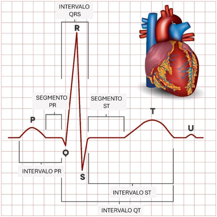
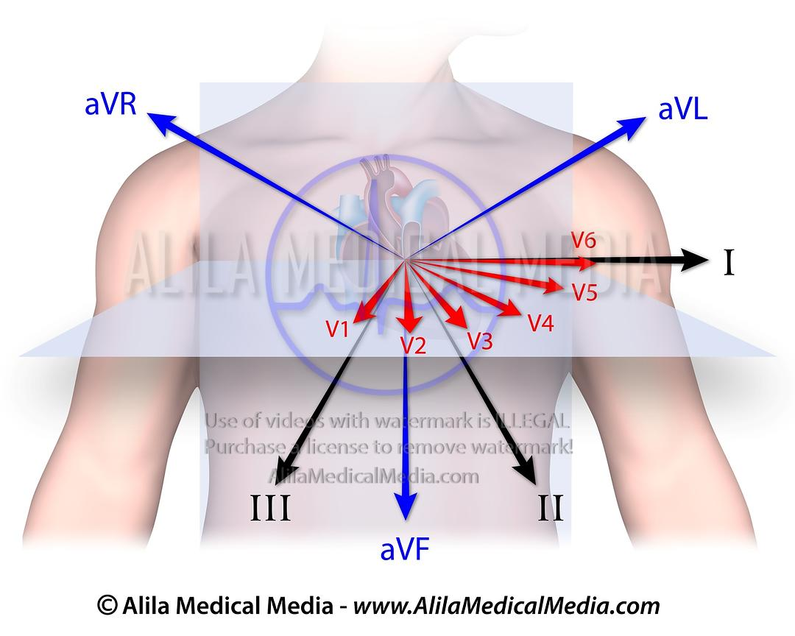

# Resumen del Laboratorio 4

## **1. Introducción**

El electrocardiograma, o ECG, es el registro de la actividad eléctrica del corazón a lo largo del tiempo, obtenido mediante electrodos de superficie colocados en la piel. Esta actividad eléctrica se origina en el sistema de conducción cardiaco y se traduce en una series de ondas características (P, complejo QRS y T) que representan, respectivamente, la despolarización auricular, la despolarización ventricular y la repolarización ventricular. Como señal biomédica, el ECG es una señal bioeléctrica, de baja amplitud (en el orden de los milivoltios) y de bajo ancho de banda (aproximadamente 0.05 - 150 Hz).
Desde el un punto de vista clínico, el ECG es una herramienta fundamental ya que permite evaluar el ritmo cardíaco, detectar infartos, arritmias e isquemias, entre otras alteraciones estructurales o funcionales del corazón, de forma no invasiva y de bajo costo. Su estudio es especialmente valioso porque combina fisiología, instrumentación y procesamiento digital de señales.

  

## **2. Objetivos**

- Aprender a configurar correctamente el BITalino (r)evolution para la adquisición de señales cardíacas
- Registrar y observar una señal ECG usando el software OpenSignals
- Reconocer las ondas principales (P, QRS, T) en un registro electrocardiográfico
- Analizar los cambios en la señal EMG bajo diferentes condiciones fisiológicas (Reposo, hiperventilación, hipoventilación, actividad física)

## **3. Materiales y equipo**

| Materiales | Cantidad | Imagen |
|:-----------|:--------:|:------:|
| Software OpenSignals | 1 |  |
| Electrodos descartables | 6 |  |
| BITalino (r)evolution | 1 |  |
| Cable de 3 electrodos | 1 |  |
| Laptop | 1 |  |

## **4. El electrocardiograma**

El ECG clínico estándar es registrado con 12 derivaciones, lo que hace posible observar la actividad eléctrica cardíaca desde distintos planos. Estas derivaciones son obtenidas usando electrodos colocados en las extremidades y en la región torácica del paciente. De estas 12 derivaciones, 6 corresponden a un plano frontal (DI, DII, DII, aVR, aVL y aVF) y las otras 6 corresponden a un plano horizontal (precordiales V1 a V6). Esta disposición es capaz de brindar una visión completa del proceso de despolarización y repolarización del corazón.

  

## **5. Procedimiento**

1. Primero, se colocaron los electrodos en 3 zonas del cuerpo de la persona a la que se le realizaron las mediciones, en las clavículas derecha e izquierda y en la cresta iliaca izquierda.
2. Posteriormente, se realizó la medición basal de las las derivadas DI, DII, y DIII, intercambiando la colocación de los electrodos para la medición de cada una de las derivadas.
3. Luego, se realizó una simulación de hiperventilación, en el cual la persona inhala la mayor cantidad de aire posible y exhala rápidamente, durante 30 segundos, con descansos de aproximadamente 1 minuto entre medición, para posteriormente realizar la medición de ECG de las 3 derivadas.
4. Después, se realizó una simulación de hipoventilación, la persona inhala la mayor cantidad de aire posible y aguanta la respiración hasta su límite máximo, cuando termina de exhalar se realiza la medición de las 3 derivadas, hubo descansos de aproximadamente 1 minuto entre medición para que la persona se recupere.
5. Finalmente, se realizaron entre 5-10 minutos de actividad aeróbica hasta que la persona llegara a su límite. Tan pronto como terminó la actividad física se tomaron las mediciones de DI, DII y DIII, intercambiando la posición de los electrodos rápidamente entre derivadas para evitar que el ritmo cardíaco se estabilice.

A continuación, se muestran los videos grabados durante la adquisición de las señales ECG en el laboratorio:

- Estado Basal:
  
  | Basal DI | Basal DII | Basal DIII |
  |:-----------:|:--------:|:------:|
  | https://github.com/user-attachments/assets/08c10fd2-b14d-4df7-9ab7-0c01d74b590f | https://github.com/user-attachments/assets/cce29694-c699-446d-b7e8-08ea2e9777f7 | |
  
- Hiperventilación:

  | Hiperventilación |
  |:-----------:|
  | https://github.com/user-attachments/assets/81fd1436-12cd-4a28-8a53-4444337e6627 |
  
- Hipoventilación:

  | Hipoventilación |
  |:-----------:|
  | https://github.com/user-attachments/assets/93acc030-8811-4839-9871-0527c0f1c176 |
  
- Actividad Física Aeróbica:

  | Ejercicio Aeróbico | Medición |
  |:-----------:|:-----------:|
  | https://github.com/user-attachments/assets/fe256214-56a9-44f2-be78-703842bffebb | https://github.com/user-attachments/assets/1aaa9691-7f8b-4eb0-9efb-d8d6023b232c |

## **6. Procesamiento de datos**

Para el procesamiento y análisis de los datos se desarrolló un código en Python utilizando las librerías NumPy, Matplotlib y SciPy. El código permite cargar la señal ECG adquirida, visualizar la señal cruda, aplicar filtros para reducir el ruido y analizar su contenido frecuencial mediante la Transformada Rápida de Fourier (FFT).

El procesamiento se realizó sobre el archivo basal1.txt, correspondiente a la adquisición de la señal ECG en condición basal. A partir de este archivo se obtuvo la señal de interés, se realizó su filtrado y posteriormente se compararon sus características tanto en el dominio temporal como en el dominio frecuencial.

**a) Librerías usadas**

Se importaron las librerías necesarias para la manipulación de los datos, visualización de las señales y aplicación de los filtros digitales.

import numpy as np
import matplotlib.pyplot as plt
from scipy.signal import butter, filtfilt, iirnotch
from pathlib import Path

La librería NumPy se utilizó para el manejo de los datos y para realizar el cálculo de la FFT. Matplotlib permitió generar las gráficas de las señales en el dominio temporal y frecuencial. Por su parte, SciPy proporcionó las funciones necesarias para implementar los filtros pasa-banda y notch. Finalmente, Path se utilizó para organizar la ubicación de los archivos y almacenar las gráficas generadas en una carpeta de resultados.
