# Resumen del Laboratorio 6

## **1. Introducción**

La electroencefalografía (EEG) es una técnica para registrar la actividad eléctrica del cerebro de forma no invasiva mediante el uso de electrodos que se colocan en el cuero cabelludo. La actividad está organizada en diferentes "ritmos" u ondas cerebrales, que se clasifican según su frecuencia y se asocian a distintos estados cognitivos y fisiológicos. Las ondas Delta (0-4 Hz) predominan en la etapa de sueño profundo y están relacionadas a procesos de descanso y recuperación. Las ondas Theta (4-8 Hz) son vinculadas con estados de somnolencia y la memoria de trabajo. Las ondas Alpha (8-12 Hz) se presentan en condiciones de relajación y reposo, especialmente con los ojos cerrados y están asociadas con la meditación y la atención. Las ondas Beta (12-25 Hz) reflejan estados de alerta, control motor y concentración activa. Por último, las ondas Gamma (>25 Hz) se asocian con la memoria, el procesamiento cognitivo rápido y la resolución de problemas. En el presente laboratorio se busca registrar y analizar señales EEG en diferentes condiciones de reposo, abriendo y cerrando los ojos a un ritmo específico, resolución de preguntas cognitivas y exposición a estímulos auditivos, como escuchar distintos tipos de música. Estas variaciones en los estímulos permiten observar la respuesta del cerebro ante distintos estados de atención, relajación o activación, además e reconocer las diferentes ondas que predominan en cada estado.

### **1.1 Bandas de frecuencia del EEG**

| Banda | Rango (Hz)* | Estado asociado | Región donde suele predominar |
|:------|:-----------:|:----------------|:------------------------------|
| Delta (δ) | 0.5 – 4 | Sueño profundo (N3); en vigilia aparece sobre todo como artefacto (parpadeos, movimientos) | Frontal en adultos durante el sueño |
| Theta (θ) | 4 – 8 | Somnolencia, memoria de trabajo, carga cognitiva | Frontal de línea media (Fz) en tareas cognitivas |
| Alpha (α) | 8 – 13 | Vigilia relajada, ojos cerrados; disminuye al abrir los ojos o al prestar atención visual | Occipital y parietal (posterior) |
| Mu (μ) | 8 – 13 | Reposo motor; se suprime al mover o imaginar un movimiento | Central, sobre la corteza sensoriomotora (C3, C4) |
| Beta (β) | 13 – 30 | Alerta, concentración activa, control motor | Frontal y central |
| Gamma (γ) | 30 – 45** | Procesamiento cognitivo rápido, integración de información | Distribuida; difícil de medir en superficie por contaminación muscular (EMG) |

\* Los límites exactos de cada banda varían entre autores; aquí se usan los mismos rangos que en el procesamiento de las señales de este laboratorio.
\** Se limita a 45 Hz porque el filtro pasa-banda utilizado corta en 45 Hz.

## **2. Objetivos del laboratorio**

- Registrar la señal EEG de un integrante del grupo durante la exposición a diferentes estímulos.
- Configurar de manera adecuada el dispositivo BiTalino.
- Representar gráficamente las señales EEG utilizando el software OpenSignals (r)evolution.
- Interpretar y analizar los datos obtenidos a partir del registro.

## **3. Materiales**

| Materiales | Cantidad | Imagen |
|:-----------|:--------:|:------:|
| Software OpenSignals | 1 |  |
| Electrodos descartables | 6 |  |
| BITalino (r)evolution | 1 |  |
| Cable de 3 electrodos | 1 |  |
| Laptop | 1 |  |

## **4. Metodología**
### **4.1 Uso de FFT e identificación de bandas EEG**
## Uso de la FFT para el análisis de señales EEG

La señal de electroencefalografía (EEG) registra la actividad eléctrica cerebral a lo largo del tiempo. Sin embargo, cuando se observa únicamente la señal original, puede ser difícil identificar qué frecuencias están presentes, ya que diferentes componentes de frecuencia se encuentran mezclados dentro de la misma señal.

Por esta razón se utiliza la **Transformada Rápida de Fourier (FFT, Fast Fourier Transform)**. La FFT es un método que permite transformar una señal desde el **dominio del tiempo** hacia el **dominio de la frecuencia**.

En el dominio del tiempo se observa cómo cambia la amplitud de la señal EEG conforme transcurre el tiempo. En cambio, después de aplicar la FFT se puede observar qué frecuencias están presentes en la señal y cuál de ellas tiene una mayor amplitud o contribución.

De forma general, este proceso puede representarse como:

**Señal en el tiempo → FFT → Señal en frecuencia**

Es decir:

**x(t) → FFT → X(f)**

donde:

- \(x(t)\) representa la señal EEG en función del tiempo.
- \(X(f)\) representa la señal después de la FFT, expresada en función de la frecuencia.
- \(f\) representa la frecuencia en Hz.

El uso de la FFT es importante en EEG porque la actividad cerebral se suele clasificar en diferentes **bandas de frecuencia**. Las principales bandas son:

| Banda EEG | Rango de frecuencia aproximado |
|---|---|
| Delta | 0.5 – 4 Hz |
| Theta | 4 – 8 Hz |
| Alpha | 8 – 13 Hz |
| Beta | 13 – 30 Hz |
| Gamma | > 30 Hz |

Una vez obtenida la FFT, estas bandas pueden identificarse observando en qué rangos de frecuencia aparecen los principales picos o aumentos de amplitud. Por ejemplo, si se observa un aumento importante alrededor de los **10 Hz**, este componente pertenece a la banda **Alpha**, ya que se encuentra dentro del rango de 8 a 13 Hz.

De esta manera, la FFT facilita la comparación de la actividad cerebral en diferentes condiciones. En el caso de una prueba de **ojos abiertos y ojos cerrados**, se espera observar principalmente cambios en la banda Alpha. Generalmente, cuando una persona se encuentra relajada con los ojos cerrados, la actividad Alpha aumenta, mientras que al abrir los ojos esta actividad suele disminuir.

Por lo tanto, la FFT permite analizar con mayor claridad la composición en frecuencia de la señal EEG e identificar qué bandas cerebrales presentan cambios durante una determinada actividad o condición experimental.

## **5. Resultados**

### **5.1 Basal**

#### **5.1.1 Sujeto 1**

Se registró la señal EEG del Sujeto 1 en condición basal (reposo) durante ~120 s. Se aplicó un filtro notch (60 Hz) y un filtro pasa-banda de 0.5–45 Hz, y se calculó la densidad espectral de potencia (PSD), la potencia relativa por banda y el espectrograma.

| | Señal cruda | Señal filtrada |
|:--|:--:|:--:|
| Tiempo |  |  |
| PSD |  |  |

| Potencia relativa por banda | Espectrograma |
|:--:|:--:|
|  |  |

**Análisis – Sujeto 1**

- **Dominio del tiempo:** la señal oscila mayormente entre ±20 µV. Se observan picos aislados de mayor amplitud (cerca de 24, 34, 60, 65, 96 y 104 s), algunos llegan a ~±40 µV. Por su forma breve y su amplitud, son compatibles con parpadeos u otros artefactos, no con actividad cerebral. Tras el filtrado estos picos se mantienen, aunque más estrechos, porque su contenido cae dentro de la banda 0.5–45 Hz.
- **PSD cruda:** la potencia es máxima por debajo de ~1 Hz y decae progresivamente con la frecuencia. Hay un aumento brusco en 60 Hz, que corresponde a la interferencia de la red eléctrica. Se ven pequeñas elevaciones alrededor de ~7 Hz y ~14 Hz, pero son leves y no permiten afirmar un ritmo dominante.
- **PSD filtrada:** desaparece la componente de 60 Hz y se atenúa lo que está por debajo de 0.5 Hz. No se aprecia un pico alpha claro.
- **Potencia relativa por banda (valores leídos de la gráfica, aproximados):** Delta ≈ 55 %, Theta ≈ 15 %, Alpha ≈ 10.5 %, Beta ≈ 16 %, Gamma ≈ 3 %.
- **Espectrograma:** la energía se concentra en 0–5 Hz durante todo el registro, con zonas más intensas cerca de ~25 s y ~100–105 s, que coinciden con los picos de la señal temporal.

**Interpretación – Sujeto 1**

- **Delta es la banda con mayor potencia relativa.** En una persona despierta y en reposo esto no indica sueño profundo. Se explica mejor por: (1) los artefactos oculares y de movimiento, que concentran su energía en frecuencias bajas, y (2) la forma natural del espectro EEG, cuya potencia disminuye a medida que aumenta la frecuencia.
- Theta, alpha y beta tienen porcentajes similares entre sí (≈ 10–16 %), lo que sugiere un estado de vigilia sin un ritmo claramente dominante.
- No se observa un pico alpha marcado. Esto es esperable si el registro se hizo con los ojos abiertos o si el electrodo no estaba sobre la región occipital, donde alpha es más visible.
- Este registro sirve como **línea base** para comparar con las demás actividades (ojos abiertos/cerrados, preguntas y canciones).

> **Limitaciones (Sujeto 1):** la amplitud está en µV aproximados (depende de la conversión usada en el procesamiento); los porcentajes por banda se leyeron de la gráfica y no de valores numéricos exportados; y los artefactos no se eliminaron, por lo que inflan la potencia de las bandas bajas.

#### **5.1.2 Sujeto 2**

Se registró la señal EEG del Sujeto 2 en condición basal (reposo) durante ~165 s, con el mismo procesamiento: filtro notch (60 Hz) y pasa-banda de 0.5–45 Hz.

| | Señal cruda | Señal filtrada |
|:--|:--:|:--:|
| Tiempo |  |  |
| PSD |  |  |

| Potencia relativa por banda | Espectrograma |
|:--:|:--:|
|  |  |

**Análisis – Sujeto 2**

- **Señal cruda:** desde el inicio hasta ~137 s la señal ocupa todo el rango de ±41 µV y aparece recortada en ambos extremos (saturación). Entre ~137 y ~165 s la amplitud baja un poco, pero sigue cerca del límite. A esta escala no se distingue ninguna forma de onda EEG: la señal está dominada por ruido de alta amplitud.
- **PSD cruda:** confirma el origen del ruido. El pico en 60 Hz llega a ~10³ µV²/Hz, unas 1000 veces más que la potencia en el resto del espectro (~10⁰–10⁻¹ µV²/Hz). Es decir, la interferencia de la red eléctrica es mucho mayor que en el Sujeto 1. Fuera de los 60 Hz, el espectro decae suavemente con la frecuencia, sin picos claros.
- **Señal filtrada:** tras el notch y el pasa-banda, la señal queda mayormente entre ±15 µV. Se observan dos eventos: un transitorio al inicio (~0 s, hasta ~40 µV), que probablemente es el efecto de arranque del filtro; y un pico aislado cerca de ~122 s (de ~+40 a ~−29 µV), compatible con un artefacto (parpadeo o movimiento). Entre ~140 y ~165 s la amplitud aumenta ligeramente.
- **PSD filtrada:** se elimina la componente de 60 Hz. El espectro es relativamente plano entre ~1 y ~30 Hz y cae hacia 45 Hz. No hay un pico alpha visible.
- **Potencia relativa por banda (valores leídos de la gráfica, aproximados):** Delta ≈ 34 %, Theta ≈ 18 %, Alpha ≈ 15 %, Beta ≈ 27 %, Gamma ≈ 6 %.
- **Espectrograma:** la energía se concentra en 0–5 Hz, con una zona más intensa cerca de ~120 s que coincide con el artefacto de la señal temporal. El resto del registro es bastante homogéneo.

**Interpretación – Sujeto 2**

- La distribución de potencia es **más repartida** que en el Sujeto 1: delta sigue siendo la banda mayor, pero beta (≈ 27 %) se acerca bastante.
- Hay que interpretar este resultado con cautela, porque la señal cruda estuvo saturada casi todo el registro. Cuando una señal se recorta, se pierde parte de la información original. Además, el recorte puede generar componentes de frecuencia que no son actividad cerebral. Por eso, **no es seguro que el aumento de beta y gamma refleje un estado de mayor alerta**. También podría deberse, en parte, al ruido residual o a actividad muscular. Con estos datos no se puede distinguir entre estas causas.
- La interferencia tan alta en 60 Hz suele relacionarse con un mal contacto entre electrodo y piel o con cables cerca de fuentes eléctricas. Esto es una posible explicación y no se verificó durante el registro.

#### **5.1.3 Comparación entre sujetos**

| Banda | Sujeto 1 (%) | Sujeto 2 (%) |
|:------|:-----------:|:-----------:|
| Delta (0.5–4 Hz) | ≈ 55 | ≈ 34 |
| Theta (4–8 Hz) | ≈ 15 | ≈ 18 |
| Alpha (8–13 Hz) | ≈ 10.5 | ≈ 15 |
| Beta (13–30 Hz) | ≈ 16 | ≈ 27 |
| Gamma (30–45 Hz) | ≈ 3 | ≈ 6 |

*Valores aproximados, leídos de las gráficas de potencia relativa.*

- En ambos sujetos **delta es la banda con mayor potencia** y en ninguno aparece un pico alpha claro.
- El Sujeto 1 tiene más potencia en bandas bajas, asociada a artefactos oculares. El Sujeto 2 tiene más potencia en bandas altas (beta y gamma), en un registro con mucha más interferencia.
- La calidad de los registros es distinta: el Sujeto 1 tiene artefactos puntuales, mientras que el Sujeto 2 presenta saturación casi continua. Por eso, **las diferencias entre sujetos no pueden atribuirse con seguridad a diferencias en su actividad cerebral**. Para usarlos como línea base, el registro del Sujeto 1 es más confiable.

> **Limitaciones:** la amplitud está en µV aproximados (depende de la conversión usada en el procesamiento); los porcentajes se leyeron de las gráficas; los artefactos no se eliminaron; y en el Sujeto 2 la saturación impide conocer la amplitud real de la señal en la mayor parte del registro.

### **5.2 Abrir y cerrar ojos**

#### **5.2.1 Sujeto 1**

Se registró la señal EEG del Sujeto 1 mientras abría y sus ojos con un total de 5 ciclos. Se aplicó un filtro notch (60 Hz) y un filtro pasa-banda de 0.5–45 Hz, y se calculó la densidad espectral de potencia (PSD), la potencia relativa por banda y el espectrograma.

| | Señal cruda | Señal filtrada |
|:--|:--:|:--:|
| Tiempo |  |  |
| PSD |  |  |

| Potencia relativa por banda | Espectrograma |
|:--:|:--:|
|  |  |

**Análisis – Sujeto 1**

- La señal EEG presenta variaciones de amplitud durante todo el registro, con varios picos que alcanzan aproximadamente ±40 µV. Estos cambios se mantienen incluso después del filtrado, por lo que corresponden principalmente a componentes de baja frecuencia presentes dentro del rango de análisis y podrían estar relacionados con movimientos oculares o parpadeos durante la actividad.

- El análisis en frecuencia muestra que la mayor parte de la potencia se concentra en las frecuencias bajas. Además, en la señal sin filtrar se observa una componente alrededor de 60 Hz, la cual desaparece después del filtrado, indicando que el filtro notch eliminó correctamente la interferencia de la red eléctrica.

- La distribución de potencia por bandas está dominada por Delta (0.5–4 Hz), con aproximadamente 79 % de la potencia total. Las demás bandas presentan valores considerablemente menores: Theta ≈ 7–8 %, Alpha ≈ 4–5 %, Beta ≈ 6–7 % y Gamma ≈ 1–2 %.

- A pesar de que la actividad consistía en realizar cinco ciclos de apertura y cierre de los ojos, no se observa un aumento claramente definido de la banda Alpha (8–13 Hz). Tanto la PSD como el espectrograma muestran una mayor concentración de energía en frecuencias bajas y no permiten distinguir claramente los cinco periodos en los que se cerraron los ojos.

- En general, las gráficas muestran un comportamiento consistente entre sí: existe una fuerte predominancia de actividad de baja frecuencia y una contribución relativamente pequeña de Alpha. Por ello, a partir del análisis global de todo el registro no se puede identificar de forma clara el cambio esperado entre los periodos de ojos abiertos y ojos cerrados.

#### **5.2.2 Sujeto 2**
Se registró la señal EEG del Sujeto 2 mientras también abría y sus ojos con un total de 5 ciclos., con el mismo procesamiento: filtro notch (60 Hz) y pasa-banda de 0.5–45 Hz.

| | Señal cruda | Señal filtrada |
|:--|:--:|:--:|
| Tiempo |  |  |
| PSD |  |  |

| Potencia relativa por banda | Espectrograma |
|:--:|:--:|
|  |  |

**Análisis – Sujeto 2**

### **5.3 Preguntas cognitivas**

#### **5.3.1 Sujeto 1**

Se registró la señal EEG del Sujeto 1 mientras se le realizaban preguntas cognitivas para que resuelva mentalmente (reposo) durante ~120 s. Se aplicó un filtro notch (60 Hz) y un filtro pasa-banda de 0.5–45 Hz, y se calculó la densidad espectral de potencia (PSD), la potencia relativa por banda y el espectrograma.

| | Señal cruda | Señal filtrada |
|:--|:--:|:--:|
| Tiempo | 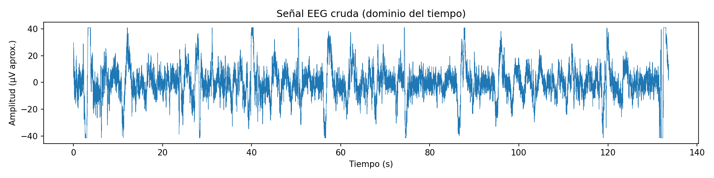 | 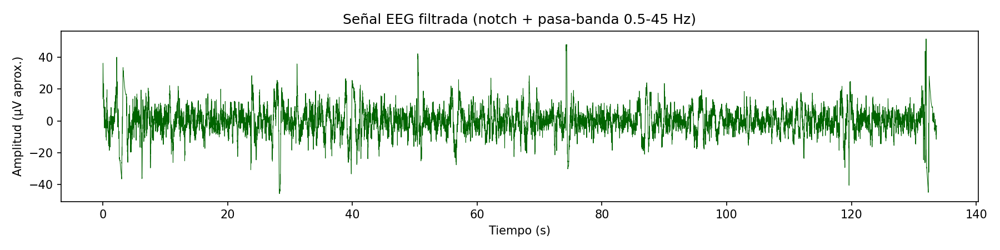 |
| PSD | 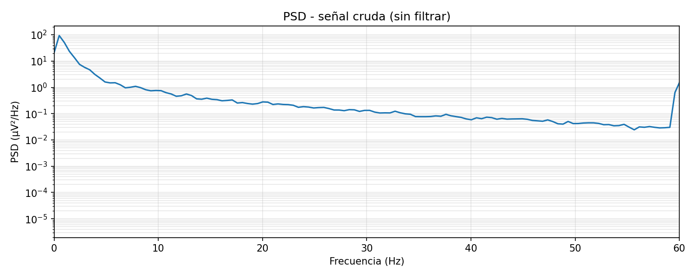 | 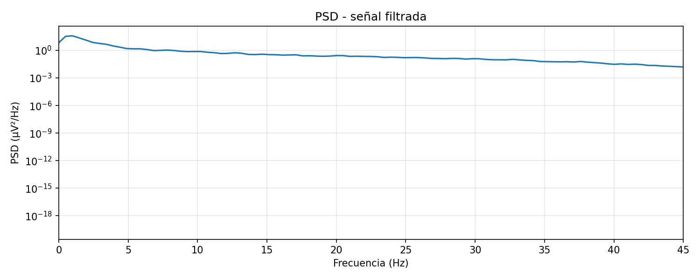 |

| Potencia relativa por banda | Espectrograma |
|:--:|:--:|
| 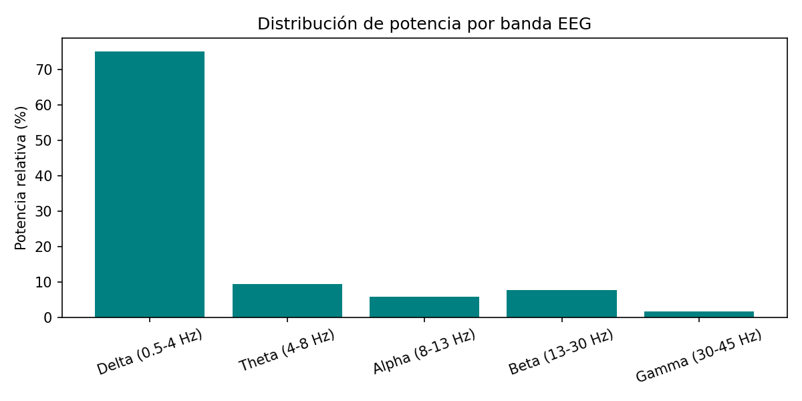 | 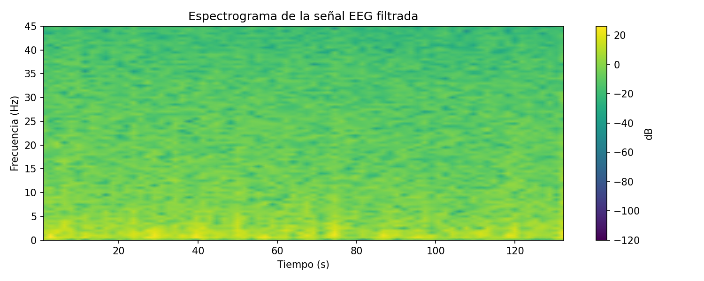 |

#### **5.3.2 Sujeto 2**

Se registró la señal EEG del Sujeto 2 mientras se le realizaban preguntas cognitivas para que resuelva mentalmente (reposo) durante ~165 s, con el mismo procesamiento: filtro notch (60 Hz) y pasa-banda de 0.5–45 Hz.

| | Señal cruda | Señal filtrada |
|:--|:--:|:--:|
| Tiempo | 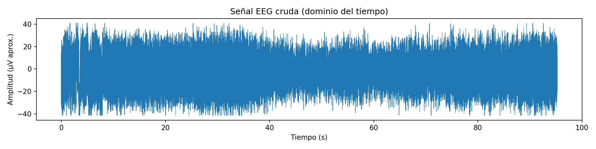 | 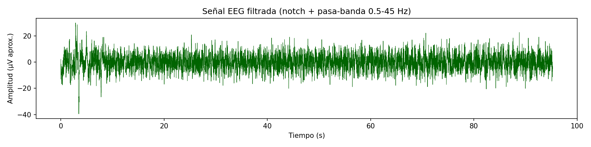 |
| PSD | 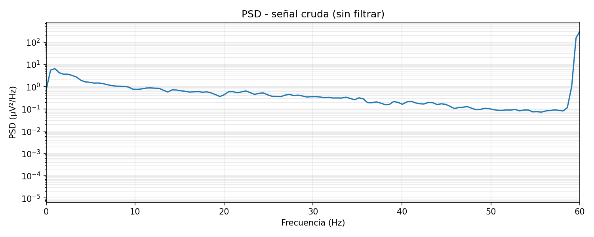 | 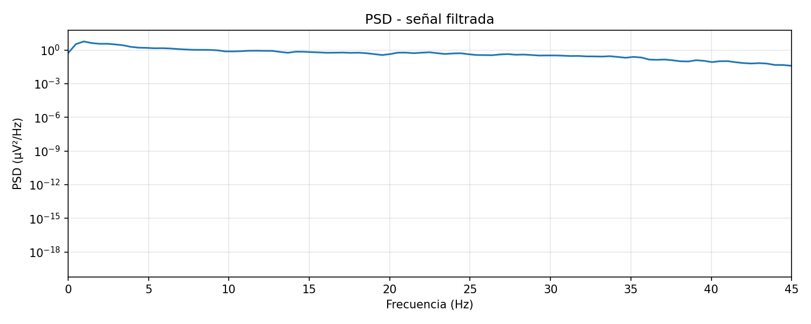 |

| Potencia relativa por banda | Espectrograma |
|:--:|:--:|
| 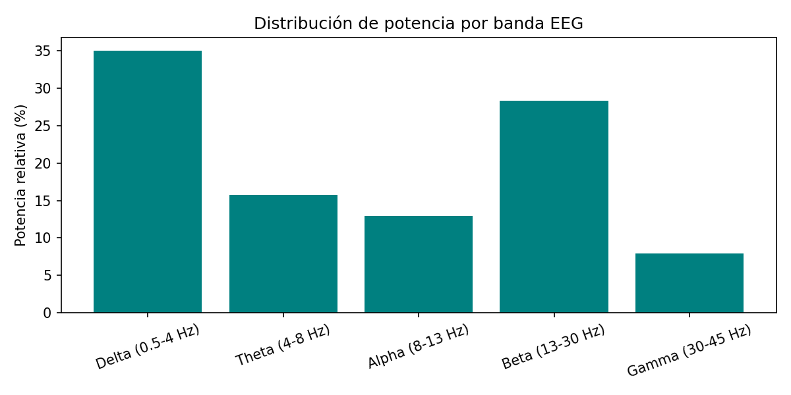 | 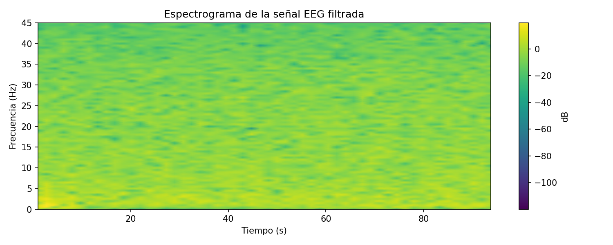 |

#### **5.3.3 Análisis**

**Sujeto 1**

- La señal cruda muestra picos de gran amplitud (hasta ±40 µV) que se repiten aproximadamente cada 15-20 s a lo largo de los 133 s de registro. Ese patrón casi periódico no es típico de actividad cortical espontánea; se parece más a artefactos de movimiento, tensión del músculo frontal o microdesplazamientos del electrodo (por ejemplo, al reacomodar la venda de los ojos).
- Esos picos sobreviven al filtrado, lo que confirma que no son ruido de alta frecuencia (el pasa-banda 0.5-45 Hz no los elimina), sino componentes de baja frecuencia mezclados con la señal real.
- La distribución de potencia está fuertemente concentrada en delta (~75%), con theta, alfa, beta y gamma todos por debajo del 10% individualmente. Este nivel de dominancia delta en un sujeto despierto y resolviendo problemas mentales es más coherente con artefactos de baja frecuencia que con actividad delta genuina (la cual se asocia normalmente a sueño profundo).
- El espectrograma confirma que la energía se concentra de forma sostenida por debajo de los 10 Hz durante todo el registro, sin cambios marcados que uno esperaría asociados a distintas fases de la tarea cognitiva.

**Sujeto 2**

- La señal cruda y filtrada son visualmente más "limpias": no se observan picos periódicos de gran amplitud como en el sujeto 1, aunque el registro es más corto (~95 s).
- La distribución de potencia es más balanceada: delta baja a ~35%, mientras que beta sube a ~28% y alfa a ~13%. Ese perfil es más consistente con un estado de alerta y participación activa en una tarea cognitiva, donde se espera mayor actividad beta asociada a concentración y procesamiento activo.
- El PSD cruda muestra el típico comportamiento 1/f de la señal EEG, con un repunte cerca de 60 Hz correspondiente a interferencia de la red eléctrica, que desaparece correctamente tras aplicar el notch.
- El espectrograma también muestra concentración de energía en bajas frecuencias, pero de forma menos dominante que en el sujeto 1, y con algo más de variación en bandas medias a lo largo del tiempo.

#### **5.3.4 Interpretación**

- La diferencia más llamativa entre los dos sujetos es el peso de la banda delta: 75% en sujeto 1 contra 35% en sujeto 2. Dado que ambos hicieron la misma tarea bajo las mismas condiciones, esa diferencia probablemente refleja calidad de señal/artefactos más que una diferencia fisiológica real entre sujetos.
- Los picos periódicos de alta amplitud en el sujeto 1 son el candidato más probable para explicar su exceso de delta: con solo 3 electrodos frontales y sin canal de referencia para movimiento ocular o EMG, el sistema no puede distinguir actividad cortical de artefactos de parpadeo, tensión muscular frontal o desplazamiento de electrodos.
- La proporción más alta de beta en sujeto 2 (28% vs 7%) es compatible con mayor actividad cognitiva activa, pero también hay que considerar que la región frontal es sensible a actividad del músculo frontalis, así que parte de ese beta (y del gamma, aunque bajo en ambos casos) podría tener un componente mioeléctrico en lugar de ser puramente cortical.
- La banda alfa es baja en ambos sujetos (6% y 13%) a pesar de tener los ojos vendados, condición bajo la cual normalmente se esperaría más alfa (ritmo alfa asociado a ojos cerrados/relajación). Esto tiene sentido porque la tarea no era de reposo, sino de resolución activa de preguntas mentales, lo cual típicamente atenúa el alfa (bloqueo/desincronización asociada a actividad cognitiva) incluso con los ojos cerrados.
- En ambos espectrogramas la energía se mantiene concentrada en frecuencias bajas durante todo el registro sin transiciones claras, lo que sugiere que, si hay cambios en el estado cognitivo durante la prueba, no se reflejan con claridad en este montaje de 3 electrodos frontales. Esto es consistente con la limitación esperada de un sistema de bajo costo y pocos canales frente a configuraciones de 16+ canales usadas en estudios de EEG más completos.
- En conjunto, los datos sugieren que el sujeto 2 ofrece una señal más representativa de actividad cortical relacionada a la tarea, mientras que el sujeto 1 está más contaminado por artefactos de baja frecuencia, probablemente de origen motor o de contacto del electrodo.

#### **5.3.5 Comparación entre sujetos**

| Banda | Sujeto 1 (%) | Sujeto 2 (%) |
|---|---|---|
| Delta (0.5-4 Hz) | ≈75 | ≈35 |
| Theta (4-8 Hz) | ≈9 | ≈16 |
| Alpha (8-13 Hz) | ≈6 | ≈13 |
| Beta (13-30 Hz) | ≈7 | ≈28 |
| Gamma (30-45 Hz) | ≈2 | ≈8 |

*Valores aproximados, leídos de los gráficos de potencia relativa generados a partir de la PSD filtrada (Welch).*

## Limitaciones

- Con 3 electrodos frontales no es posible aislar movimiento ocular o actividad muscular de la señal EEG real; lo que se interpreta como "delta" podría incluir artefactos de baja frecuencia no relacionados a actividad cerebral.
- La duración de los registros no fue idéntica entre sujetos (≈133 s vs ≈95 s), lo que puede afectar la resolución espectral del cálculo de Welch y dificultar una comparación estrictamente controlada.
- No se aplicó ningún método de rechazo de artefactos (como ICA o umbral de amplitud) antes de calcular las bandas, por lo que los picos de gran amplitud observados en el sujeto 1 entraron directamente al cálculo de potencia.

### **5.5 Música ruidosa: Candy Perreo y Hottiefrutti**

#### **5.5.1 Procedimiento**

Cada sujeto escuchó una canción distinta mientras se registraba su señal EEG con el BITalino. El Sujeto 1 (Rolando) escuchó Hottiefrutti durante ~77 s. El Sujeto 2 (Claudia) escuchó Candy Perreo durante ~32 s. Ambos sujetos permanecieron sentados, con los ojos cerrados, escuchando la canción por audífonos. 

El procesamiento fue el mismo que en la condición basal: filtro notch en 60 Hz, filtro pasa-banda de 0.5–45 Hz, densidad espectral de potencia (PSD), potencia relativa por banda y espectrograma.

#### **5.5.2 Videos**

- Hottiefrutti (Sujeto 1): https://www.youtube.com/watch?v=is8UDe2PhKQ
Es una canción con influencias del género funk brasileño.
- Candy Perreo (Sujeto 2): https://www.youtube.com/watch?v=WdPsMIJJBD4&list=RDWdPsMIJJBD4&start_radio=1 
En una canción de reggaetón. 
#### **5.5.3 Hottiefrutti (Sujeto 1)**

| | Señal cruda | Señal filtrada |
|:--|:--:|:--:|
| Tiempo |  |  |
| PSD |  |  |

| Potencia relativa por banda | Espectrograma |
|:--:|:--:|
|  |  |

**Gráficas en el tiempo**

- Las gráficas muestran la señal EEG del Sujeto 1. El eje X es el tiempo en segundos (0–77 s) y el eje Y la amplitud en µV aproximados.
- **Señal cruda:** oscila mayormente entre ±20 µV. En los primeros ~35 s hay una deriva lenta de la línea base. Hay eventos de gran amplitud cerca de 6.3, 10.4, 16–18, 27–29 y 57.4 s. Varios llegan al límite de ±41 µV (6.3, 10.4, 16.2 y 57.4 s). Entre ~16.5 y ~17 s la señal queda plana en +41 µV, lo que indica saturación breve. Por su forma y duración, estos eventos son compatibles con parpadeos o movimientos. Desde ~35 s la señal es más estable.
- **Señal filtrada:** queda mayormente entre ±15 µV. El filtro elimina la deriva lenta, pero los artefactos se mantienen: +38 µV aprox a 10.4 s aprox, −45 µV a 16.2 s aprox, +32 µV a 27.5 aprox s y −37 µV a 57.4 s aprox. Los tramos saturados no se pueden corregir con el filtrado.

**Gráficas en frecuencia**

- **PSD cruda:** la potencia es máxima cerca de 0.5 Hz (~60 µV²/Hz) y decae hasta ~0.03 µV²/Hz en 50 Hz. El pico de 60 Hz solo llega a ~4 µV²/Hz, así que la interferencia de la red es baja. Hay elevaciones leves cerca de ~10 y ~14 Hz, insuficientes para hablar de un ritmo dominante.
- **PSD filtrada:** desaparece la componente de 60 Hz. El máximo está cerca de 1 Hz y el espectro decae de forma suave hasta 45 Hz. No hay un pico alpha visible.
- **Potencia relativa por banda (valores leídos de la gráfica, aproximados):** Delta ≈ 70 %, Theta ≈ 10 %, Alpha ≈ 5 %, Beta ≈ 8 %, Gamma ≈ 2 %.
- **Espectrograma:** la energía se concentra en 0–10 Hz. Las zonas más intensas están cerca de ~10 s, ~16–18 s, ~27–29 s y ~57–60 s, que coinciden con los artefactos de la señal temporal. En las bandas superiores no hay cambios a lo largo del registro.

**Interpretación**

- Delta sube de ≈ 55 % en el basal a ≈ 73 % con Hottiefrutti. El aumento coincide con un registro con más artefactos grandes y con saturación breve. Se explica mejor por parpadeos o movimientos que por un cambio en la actividad cerebral.
- La potencia relativa es un porcentaje. Si delta crece, las demás bandas bajan aunque su potencia real no cambie. Al recalcular sin delta, la proporción entre las otras bandas es parecida al basal: beta pasa de ≈ 36 % a ≈ 31 % y theta de ≈ 34 % a ≈ 42 %. No hay un aumento de beta atribuible a la canción.

#### **5.5.4 Candy Perreo (Sujeto 2)**

| | Señal cruda | Señal filtrada |
|:--|:--:|:--:|
| Tiempo |  |  |
| PSD |  |  |

| Potencia relativa por banda | Espectrograma |
|:--:|:--:|
|  |  |

**Gráficas en el tiempo**

- Las gráficas muestran la señal EEG del Sujeto 2. El eje X es el tiempo en segundos (0–32 s) y el eje Y la amplitud en µV aproximados.
- **Señal cruda:** forma una banda densa que ocupa casi todo el rango de ±41 µV. Toca el límite con frecuencia, sobre todo entre 0–4 s, 10–13 s, 16–18 s y 20–23 s. Hay saturación en buena parte del registro. La amplitud baja un poco entre ~4–8 s y desde ~25 s. A esta escala no se distingue ninguna forma de onda EEG, igual que en su registro basal.
- **Señal filtrada:** queda mayormente entre ±10 µV. Al inicio hay un transitorio de hasta −26 µV que dura ~1 s, probablemente por el arranque del filtro. Hay picos aislados cerca de 7 s (+19 µV), 8 s (−17 µV) y 18–18.5 s (±17 µV). Los artefactos son menores que con Hottiefrutti.

**Gráficas en frecuencia**

- **PSD cruda:** el pico en 60 Hz llega a ~3–4 × 10² µV²/Hz, mientras el resto del espectro está entre ~5 µV²/Hz (cerca de 1 Hz) y ~0.03 µV²/Hz (cerca de 57 Hz). La interferencia de la red domina la señal cruda. Fuera de los 60 Hz hay elevaciones leves cerca de ~9.5, ~15 y ~20 Hz.
- **PSD filtrada:** se elimina la componente de 60 Hz. El espectro tiene un máximo cerca de 1 Hz y queda casi plano entre ~3 y ~30 Hz. Luego cae hacia 45 Hz. No hay un pico alpha claro.
- **Potencia relativa por banda (valores leídos de la gráfica, aproximados):** Delta ≈ 35 %, Theta ≈ 16 %, Alpha ≈ 15 %, Beta ≈ 28 %, Gamma ≈ 6.5 %.
- **Espectrograma:** la energía está repartida de forma bastante homogénea. Hay algo más de energía en 0–5 Hz cerca de ~5–10 s y ~22–30 s, sin un patrón temporal claro.

**Interpretación**

- La distribución es casi igual a la del basal de este sujeto (Delta ≈ 34 %, Theta ≈ 18 %, Alpha ≈ 15 %, Beta ≈ 27 %, Gamma ≈ 6 %). Puede que la canción no haya producido un cambio medible. También puede que ambos registros estén dominados por las mismas condiciones de ruido. Con la saturación presente no se puede distinguir entre ambas opciones.
- El beta relativamente alto no indica por sí solo mayor activación. Con un espectro casi plano, las bandas más anchas acumulan más potencia solo por su ancho: beta abarca 17 Hz, mientras que delta abarca 3.5 Hz.
- El registro dura solo ~32 s, lo que da menos ventanas para estimar la PSD y resultados menos estables.

#### **5.5.5 Comparación entre canciones**

| Banda | S1 basal (%) | Hottiefrutti, S1 (%) | S2 basal (%) | Candy Perreo, S2 (%) |
|:------|:-----------:|:-----------:|:-----------:|:-----------:|
| Delta (0.5–4 Hz) | ≈ 55 | ≈ 73 | ≈ 34 | ≈ 35 |
| Theta (4–8 Hz) | ≈ 15 | ≈ 11 | ≈ 18 | ≈ 16 |
| Alpha (8–13 Hz) | ≈ 10.5 | ≈ 5.5 | ≈ 15 | ≈ 15 |
| Beta (13–30 Hz) | ≈ 16 | ≈ 8 | ≈ 27 | ≈ 28 |
| Gamma (30–45 Hz) | ≈ 3 | ≈ 1.5 | ≈ 6 | ≈ 6.5 |

*Valores aproximados, leídos de las gráficas de potencia relativa.*

- Cada sujeto escuchó una canción distinta. Por eso, comparar Hottiefrutti con Candy Perreo directamente mezcla el efecto de la canción con las diferencias entre sujetos y entre la calidad de los registros. La comparación más útil es la de cada canción con el basal del mismo sujeto.
- Frente a su basal, el Sujeto 1 muestra más delta, en un registro con más artefactos. El Sujeto 2 prácticamente no cambia.
- En el dominio del tiempo, el registro de Hottiefrutti tiene artefactos grandes y aislados, mientras que el de Candy Perreo está saturado de forma casi continua por la interferencia de 60 Hz. Esta diferencia es la misma que ya existía entre los dos sujetos en el basal.

#### **5.5.7 Conclusión**

No se encontró evidencia de que Hottiefrutti o Candy Perreo hayan cambiado el EEG de los sujetos. Con Hottiefrutti, delta subió de ≈ 55 % a ≈ 73 %. Ese aumento coincide con más parpadeos y con los tramos donde la señal se saturó. Si se quita delta del cálculo, las demás bandas quedan casi igual que en el basal. En Candy Perreo la distribución apenas cambió respecto al basal de ese sujeto, aunque esto dice poco porque la señal cruda estuvo saturada por los 60 Hz durante gran parte del registro. Para saber si la canción influye, lo mínimo sería que ambas las escuche el mismo sujeto durante el mismo tiempo. El contacto de los electrodos también tendría que mejorar, sobre todo en el caso de Candy Perreo.
> **Limitaciones:** cada canción la escuchó un sujeto distinto; la amplitud está en µV aproximados; los porcentajes se leyeron de las gráficas; los artefactos no se eliminaron; los registros tienen duraciones distintas (~77 s y ~32 s); y en el Sujeto 2 la saturación impide conocer la amplitud real de la señal en buena parte del registro.

## **6. Cuestionario**

### **Q1. ¿Cuáles son las frecuencias relevantes del EEG y en qué se diferencian según la región del cerebro?**

Las frecuencias relevantes del EEG de superficie se encuentran aproximadamente entre **0.5 y 45 Hz** y se agrupan en las bandas delta, theta, alpha, beta y gamma (ver tabla de la sección 1.1). Por encima de ~45 Hz la señal cerebral es muy pequeña y se mezcla con actividad muscular y con la interferencia de la red (60 Hz), por eso en este laboratorio se filtró hasta 45 Hz.

Cada banda no aparece con la misma intensidad en todo el cuero cabelludo:

- **Región occipital y parietal (posterior):** es donde predomina el **ritmo alpha**, sobre todo con los ojos cerrados y en reposo. Al abrir los ojos o prestar atención visual, alpha disminuye (Berger, 1929; Schomer & Lopes da Silva, 2018).
- **Región central (sensoriomotora):** aparece el **ritmo mu** (8–13 Hz), que se reduce cuando la persona mueve o imagina mover una extremidad. También hay actividad **beta** asociada al control motor (Pfurtscheller & Lopes da Silva, 1999).
- **Región frontal:** suele mostrar más **beta** durante la concentración y **theta de línea media** durante tareas de memoria o carga cognitiva (Klimesch, 1999). En electrodos frontopolares (FP1/FP2) también se registran con facilidad artefactos oculares, que aparecen como actividad de baja frecuencia (delta).
- **Delta** en adultos sanos aparece sobre todo durante el sueño profundo; en vigilia su presencia elevada suele indicar artefactos.
- **Gamma** está más distribuida y es difícil de medir en superficie porque se confunde con la actividad muscular.

En los registros basales de ambos sujetos predominó delta y no se observó un pico alpha claro. Esto es coherente con registros que no se hicieron sobre la región occipital y que incluyen artefactos.

### **Q2. ¿Qué tipo de filtro es esencial al trabajar con señales de EEG? ¿Por qué necesitamos aplicar ese filtro?**

El filtro que no se puede omitir al trabajar con EEG es el **filtro notch en la frecuencia de la red eléctrica local** (60 Hz en Perú, ya que la red eléctrica funciona a esa frecuencia). La amplitud del EEG está en el rango de microvoltios, y el cableado, el propio cuerpo y los equipos cercanos actúan como antenas para el campo electromagnético irradiado por las líneas eléctricas y los tomacorrientes. Sin eliminarlo, esta interferencia puede ser órdenes de magnitud más grande que la señal cerebral real y enmascararla por completo, como se ve en los gráficos de PSD cruda donde aparece un pico pronunciado justo en el borde de la región de 60 Hz.

Junto con el filtro notch, un **filtro pasa-banda** (comúnmente alrededor de 0.5-45 Hz para análisis general de EEG) también es esencial. Este elimina dos cosas a la vez:
- Deriva de muy baja frecuencia por debajo de ~0.5 Hz, causada por cambios en la impedancia electrodo-piel, sudor o artefactos de movimiento lento, que de otra forma domina el espectro y puede confundirse con actividad delta.
- Ruido de alta frecuencia por encima de 45 Hz, que en su mayoría es actividad muscular (EMG) del cuero cabelludo, la mandíbula o la frente, en lugar de actividad cortical, además de cualquier ruido electrónico remanente.

Juntos, estos dos filtros conservan únicamente el rango de frecuencia donde existen los ritmos de EEG corticales reales (de delta a gamma), y rechazan los dos principales contaminantes no neuronales (interferencia de línea eléctrica y deriva/ruido muscular) que de otra forma harían que cualquier análisis de potencia por banda careciera de sentido.

### **Q7. Según tu conocimiento, ¿la amplitud del EEG equivale al nivel de concentración que has aplicado?**

No, la amplitud por sí sola no es un indicador directo de concentración. Lo que cambia con la concentración y el esfuerzo cognitivo es principalmente la **distribución de la potencia entre las bandas de frecuencia**, no la amplitud cruda de la señal. Por ejemplo, un aumento en la potencia beta relativa a delta/theta está más asociado con compromiso mental activo, mientras que una caída en alfa está asociada con que el cerebro se aleja de un estado relajado e inactivo hacia un procesamiento activo. La amplitud cruda por sí sola puede aumentar fácilmente debido a artefactos (parpadeo, apretar la mandíbula, movimiento del electrodo, incluso sudoración), que no tienen nada que ver con qué tan concentrada está la persona, y esto fue visible en los registros frontales donde aparecieron picos de gran amplitud independientemente de la tarea cognitiva.

Entonces, interpretar la concentración a partir del EEG implica observar la potencia relativa por banda o razones específicas (como beta/alfa o theta/beta), evaluadas sobre una señal limpia y filtrada de artefactos, en lugar de simplemente observar qué tan "grande" se vuelve la forma de onda cruda en un momento dado.

## **7. Referencias**

- Berger, H. (1929). Über das Elektrenkephalogramm des Menschen. *Archiv für Psychiatrie und Nervenkrankheiten, 87*, 527–570.
- Klimesch, W. (1999). EEG alpha and theta oscillations reflect cognitive and memory performance: A review and analysis. *Brain Research Reviews, 29*(2–3), 169–195. https://doi.org/10.1016/S0165-0173(98)00056-3
- Pfurtscheller, G., & Lopes da Silva, F. H. (1999). Event-related EEG/MEG synchronization and desynchronization: Basic principles. *Clinical Neurophysiology, 110*(11), 1842–1857. https://doi.org/10.1016/S1388-2457(99)00141-8
- Schomer, D. L., & Lopes da Silva, F. H. (Eds.). (2018). *Niedermeyer's electroencephalography: Basic principles, clinical applications, and related fields* (7th ed.). Oxford University Press.
