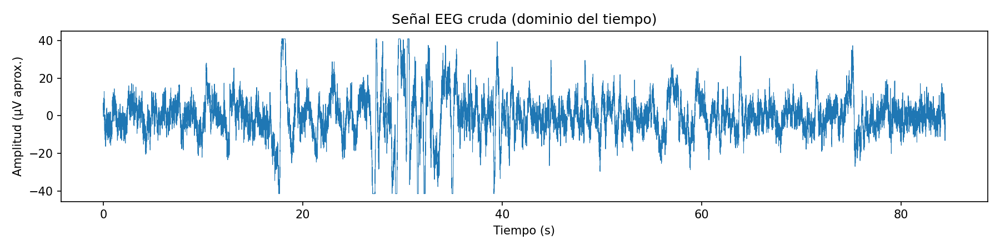
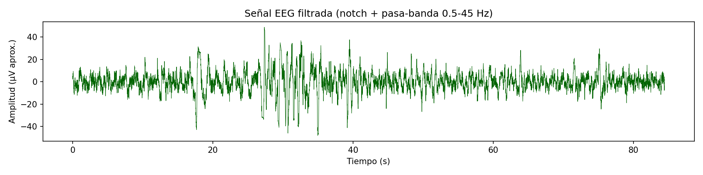
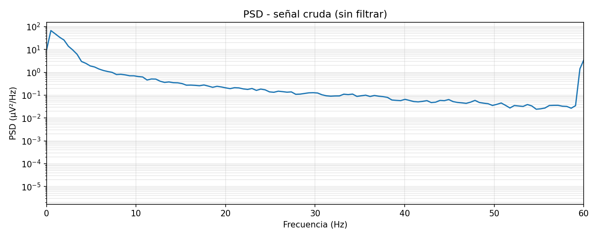
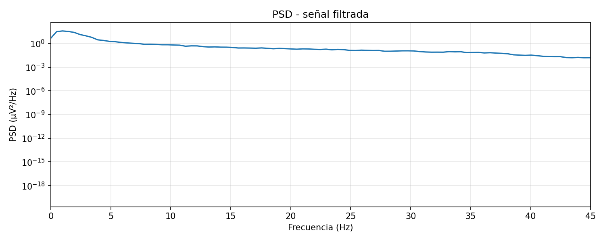
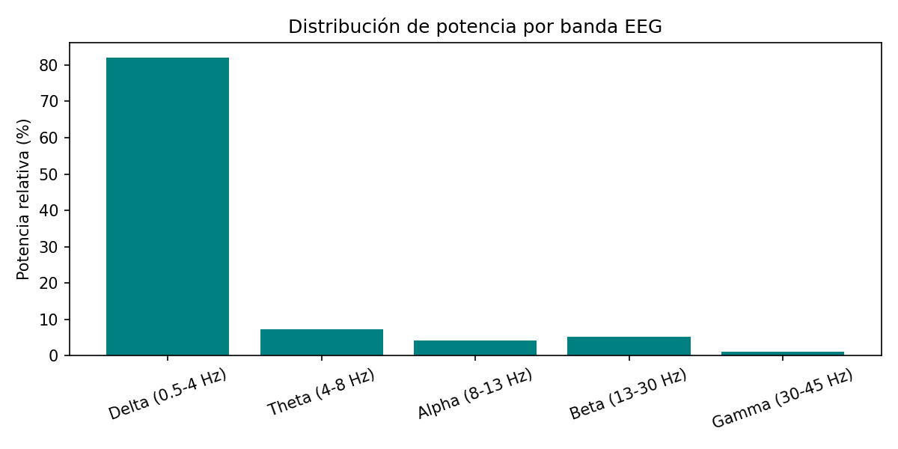
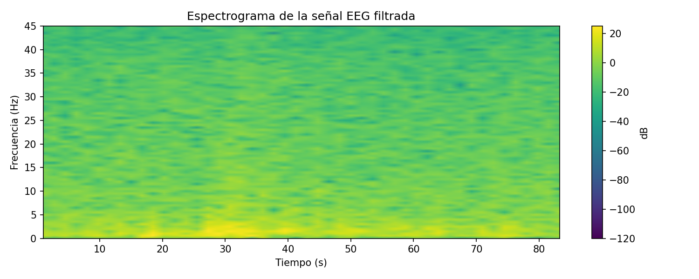
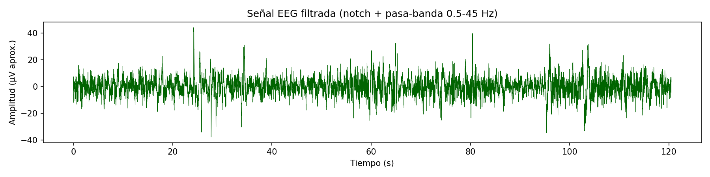
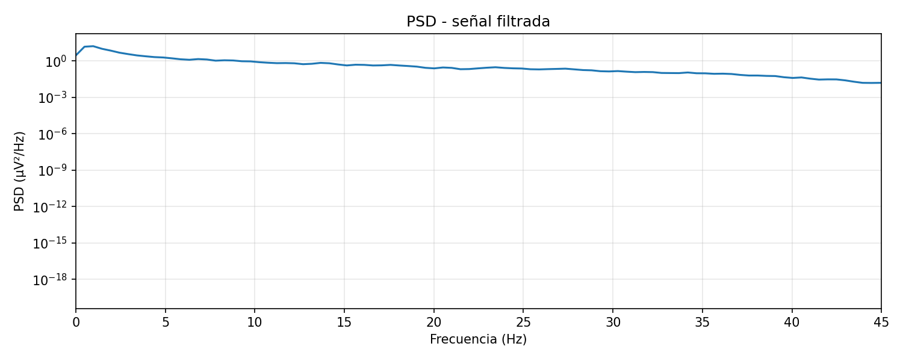

# Resumen del Laboratorio 6

## **1. Introducción**

La electroencefalografía (EEG) es una técnica para registrar la actividad eléctrica del cerebro de forma no invasiva mediante el uso de electrodos que se colocan en el cuero cabelludo. La actividad está organizada en diferentes "ritmos" u ondas cerebrales, que se clasifican según su frecuencia y se asocian a distintos estados cognitivos y fisiológicos. Las ondas Delta (0-4 Hz) predominan en la etapa de sueño profundo y están relacionadas a procesos de descanso y recuperación. Las ondas Theta (4-8 Hz) son vinculadas con estados de somnolencia y la memoria de trabajo. Las ondas Alpha (8-12 Hz) se presentan en condiciones de relajación y reposo, especialmente con los ojos cerrados y están asociadas con la meditación y la atención. Las ondas Beta (12-25 Hz) reflejan estados de alerta, control motor y concentración activa. Por último, las ondas Gamma (>25 Hz) se asocian con la memoria, el procesamiento cognitivo rápido y la resolución de problemas. En el presente laboratorio se busca registrar y analizar señales EEG en diferentes condiciones de reposo, abriendo y cerrando los ojos a un ritmo específico, resolución de preguntas cognitivas y exposición a estímulos auditivos, como escuchar distintos tipos de música. Estas variaciones en los estímulos permiten observar la respuesta del cerebro ante distintos estados de atención, relajación o activación, además e reconocer las diferentes ondas que predominan en cada estado.

### **1.1 Bandas de frecuencia del EEG**

| Banda | Rango (Hz)* | Estado asociado | Región donde suele predominar |
|:------|:-----------:|:----------------|:------------------------------|
| Delta (δ) | 0.5 – 4 | Sueño profundo (N3); en vigilia aparece sobre todo como artefacto (parpadeos, movimientos) | Frontal en adultos durante el sueño |
| Theta (θ) | 4 – 8 | Somnolencia, memoria de trabajo, carga cognitiva | Frontal de línea media (Fz) en tareas cognitivas |
| Alpha (α) | 8 – 13 | Vigilia relajada, ojos cerrados; disminuye al abrir los ojos o al prestar atención visual | Occipital y parietal (posterior) |
| Mu (μ) | 8 – 13 | Reposo motor; se suprime al mover o imaginar un movimiento | Central, sobre la corteza sensoriomotora (C3, C4) |
| Beta (β) | 13 – 30 | Alerta, concentración activa, control motor | Frontal y central |
| Gamma (γ) | 30 – 45** | Procesamiento cognitivo rápido, integración de información | Distribuida; difícil de medir en superficie por contaminación muscular (EMG) |

\* Los límites exactos de cada banda varían entre autores; aquí se usan los mismos rangos que en el procesamiento de las señales de este laboratorio.
\** Se limita a 45 Hz porque el filtro pasa-banda utilizado corta en 45 Hz.

## **2. Objetivos del laboratorio**

- Registrar la señal EEG de un integrante del grupo durante la exposición a diferentes estímulos.
- Configurar de manera adecuada el dispositivo BiTalino.
- Representar gráficamente las señales EEG utilizando el software OpenSignals (r)evolution.
- Interpretar y analizar los datos obtenidos a partir del registro.

## **3. Materiales**

| Materiales | Cantidad | Imagen |
|:-----------|:--------:|:------:|
| Software OpenSignals | 1 |  |
| Electrodos descartables | 6 |  |
| BITalino (r)evolution | 1 |  |
| Cable de 3 electrodos | 1 |  |
| Laptop | 1 |  |

## **4. Metodología**

## **5. Resultados**

### **5.1 Basal**

Se realizaron dos registros en condición basal (reposo): **Basal 1** (~84 s) y **Basal 2** (~120 s). En ambos se aplicó un filtro notch (60 Hz) y un filtro pasa-banda de 0.5–45 Hz, y se calculó la densidad espectral de potencia (PSD), la potencia relativa por banda y el espectrograma.

#### **Basal 1**

| | Señal cruda | Señal filtrada |
|:--|:--:|:--:|
| Tiempo |  |  |
| PSD |  |  |

| Potencia relativa por banda | Espectrograma |
|:--:|:--:|
|  |  |

- **Dominio del tiempo:** la señal cruda oscila mayormente entre ±20 µV, pero entre ~17–18 s y ~27–40 s aparecen deflexiones grandes y lentas que llegan al límite de ±41 µV, donde la señal se ve recortada (saturación). Por su forma y amplitud, lo más probable es que sean artefactos (parpadeos o movimientos) y no actividad cerebral. El filtrado no los elimina porque su contenido cae dentro de la banda 0.5–45 Hz.
- **PSD cruda:** la potencia es máxima por debajo de 1 Hz y decae de forma progresiva con la frecuencia. Se observa un aumento brusco en 60 Hz, que corresponde a la interferencia de la red eléctrica.
- **PSD filtrada:** desaparece el pico de 60 Hz y la componente por debajo de 0.5 Hz se atenúa. No se aprecia un pico claro en la banda alpha.
- **Potencia por banda (valores leídos de la gráfica, aproximados):** Delta ≈ 82 %, Theta ≈ 7 %, Alpha ≈ 4 %, Beta ≈ 5 %, Gamma ≈ 1 %.
- **Espectrograma:** la energía se concentra en 0–5 Hz durante todo el registro, con mayor intensidad entre ~27 y ~40 s, justo donde aparecen los artefactos en la señal temporal.

#### **Basal 2**

| | Señal cruda | Señal filtrada |
|:--|:--:|:--:|
| Tiempo |  |  |
| PSD |  |  |

| Potencia relativa por banda | Espectrograma |
|:--:|:--:|
|  |  |

- **Dominio del tiempo:** la señal es más estable que en el Basal 1. Se ven picos aislados de gran amplitud (por ejemplo, cerca de 24, 34, 60, 65, 96 y 104 s), compatibles con parpadeos u otros artefactos breves; tras el filtrado se mantienen, aunque más estrechos.
- **PSD cruda:** mismo patrón de decaimiento con la frecuencia y el pico de interferencia en 60 Hz. Se observan pequeñas elevaciones alrededor de ~7 Hz y ~14 Hz, pero son leves y no permiten afirmar un ritmo dominante.
- **PSD filtrada:** se elimina la componente de 60 Hz; el espectro es más plano que en el Basal 1.
- **Potencia por banda (valores leídos de la gráfica, aproximados):** Delta ≈ 55 %, Theta ≈ 15 %, Alpha ≈ 10.5 %, Beta ≈ 16 %, Gamma ≈ 3 %.
- **Espectrograma:** sigue predominando la energía en 0–5 Hz, con zonas más intensas cerca de ~25 s y ~100–105 s, que coinciden con los picos de la señal temporal.

#### **Comparación e interpretación**

- En ambos registros **delta es la banda con mayor potencia relativa**, pero en el Basal 1 es mucho más alta (≈ 82 % frente a ≈ 55 %). La diferencia coincide con que el Basal 1 tiene más artefactos de baja frecuencia y saturación, por lo que buena parte de esa potencia delta probablemente no es actividad cerebral.
- En una persona despierta en reposo no se espera que delta refleje sueño profundo. Su predominio aquí se explica mejor por: (1) artefactos oculares y de movimiento, que concentran su energía en frecuencias bajas, y (2) la forma natural del espectro EEG, cuya potencia disminuye a medida que aumenta la frecuencia.
- El **Basal 2 es el registro más confiable** como línea base: tiene menos artefactos y una distribución más repartida entre theta, alpha y beta.
- No se observa un pico alpha marcado en ninguno de los dos registros. Esto es esperable si el registro fue con ojos abiertos o si el electrodo no estaba sobre la región occipital, donde alpha es más visible.

> **Limitaciones:** la amplitud está en µV aproximados (depende de la conversión usada en el procesamiento); los porcentajes por banda se leyeron de las gráficas y no de valores numéricos exportados; y la saturación del Basal 1 impide conocer la amplitud real de esos segmentos.

## **6. Cuestionario**

### **Q1. ¿Cuáles son las frecuencias relevantes del EEG y en qué se diferencian según la región del cerebro?**

Las frecuencias relevantes del EEG de superficie se encuentran aproximadamente entre **0.5 y 45 Hz** y se agrupan en las bandas delta, theta, alpha, beta y gamma (ver tabla de la sección 1.1). Por encima de ~45 Hz la señal cerebral es muy pequeña y se mezcla con actividad muscular y con la interferencia de la red (60 Hz), por eso en este laboratorio se filtró hasta 45 Hz.

Cada banda no aparece con la misma intensidad en todo el cuero cabelludo:

- **Región occipital y parietal (posterior):** es donde predomina el **ritmo alpha**, sobre todo con los ojos cerrados y en reposo. Al abrir los ojos o prestar atención visual, alpha disminuye (Berger, 1929; Schomer & Lopes da Silva, 2018).
- **Región central (sensoriomotora):** aparece el **ritmo mu** (8–13 Hz), que se reduce cuando la persona mueve o imagina mover una extremidad. También hay actividad **beta** asociada al control motor (Pfurtscheller & Lopes da Silva, 1999).
- **Región frontal:** suele mostrar más **beta** durante la concentración y **theta de línea media** durante tareas de memoria o carga cognitiva (Klimesch, 1999). En electrodos frontopolares (FP1/FP2) también se registran con facilidad artefactos oculares, que aparecen como actividad de baja frecuencia (delta).
- **Delta** en adultos sanos aparece sobre todo durante el sueño profundo; en vigilia su presencia elevada suele indicar artefactos.
- **Gamma** está más distribuida y es difícil de medir en superficie porque se confunde con la actividad muscular.

En nuestro registro basal predominó delta y no se observó un pico alpha claro, lo que es coherente con un registro que no se hizo sobre la región occipital y que incluye artefactos de baja frecuencia.

## **7. Referencias**

- Berger, H. (1929). Über das Elektrenkephalogramm des Menschen. *Archiv für Psychiatrie und Nervenkrankheiten, 87*, 527–570.
- Klimesch, W. (1999). EEG alpha and theta oscillations reflect cognitive and memory performance: A review and analysis. *Brain Research Reviews, 29*(2–3), 169–195. https://doi.org/10.1016/S0165-0173(98)00056-3
- Pfurtscheller, G., & Lopes da Silva, F. H. (1999). Event-related EEG/MEG synchronization and desynchronization: Basic principles. *Clinical Neurophysiology, 110*(11), 1842–1857. https://doi.org/10.1016/S1388-2457(99)00141-8
- Schomer, D. L., & Lopes da Silva, F. H. (Eds.). (2018). *Niedermeyer's electroencephalography: Basic principles, clinical applications, and related fields* (7th ed.). Oxford University Press.
