# Resumen del Laboratorio 6

## **1. Introducción**

La electroencefalografía (EEG) es una técnica para registrar la actividad eléctrica del cerebro de forma no invasiva mediante el uso de electrodos que se colocan en el cuero cabelludo. La actividad está organizada en diferentes "ritmos" u ondas cerebrales, que se clasifican según su frecuencia y se asocian a distintos estados cognitivos y fisiológicos. Las ondas Delta (0-4 Hz) predominan en la etapa de sueño profundo y están relacionadas a procesos de descanso y recuperación. Las ondas Theta (4-8 Hz) son vinculadas con estados de somnolencia y la memoria de trabajo. Las ondas Alpha (8-12 Hz) se presentan en condiciones de relajación y reposo, especialmente con los ojos cerrados y están asociadas con la meditación y la atención. Las ondas Beta (12-25 Hz) reflejan estados de alerta, control motor y concentración activa. Por último, las ondas Gamma (>25 Hz) se asocian con la memoria, el procesamiento cognitivo rápido y la resolución de problemas. En el presente laboratorio se busca registrar y analizar señales EEG en diferentes condiciones de reposo, abriendo y cerrando los ojos a un ritmo específico, resolución de preguntas cognitivas y exposición a estímulos auditivos, como escuchar distintos tipos de música. Estas variaciones en los estímulos permiten observar la respuesta del cerebro ante distintos estados de atención, relajación o activación, además e reconocer las diferentes ondas que predominan en cada estado.

### **1.1 Bandas de frecuencia del EEG**

| Banda | Rango (Hz)* | Estado asociado | Región donde suele predominar |
|:------|:-----------:|:----------------|:------------------------------|
| Delta (δ) | 0.5 – 4 | Sueño profundo (N3); en vigilia aparece sobre todo como artefacto (parpadeos, movimientos) | Frontal en adultos durante el sueño |
| Theta (θ) | 4 – 8 | Somnolencia, memoria de trabajo, carga cognitiva | Frontal de línea media (Fz) en tareas cognitivas |
| Alpha (α) | 8 – 13 | Vigilia relajada, ojos cerrados; disminuye al abrir los ojos o al prestar atención visual | Occipital y parietal (posterior) |
| Mu (μ) | 8 – 13 | Reposo motor; se suprime al mover o imaginar un movimiento | Central, sobre la corteza sensoriomotora (C3, C4) |
| Beta (β) | 13 – 30 | Alerta, concentración activa, control motor | Frontal y central |
| Gamma (γ) | 30 – 45** | Procesamiento cognitivo rápido, integración de información | Distribuida; difícil de medir en superficie por contaminación muscular (EMG) |

\* Los límites exactos de cada banda varían entre autores; aquí se usan los mismos rangos que en el procesamiento de las señales de este laboratorio.
\** Se limita a 45 Hz porque el filtro pasa-banda utilizado corta en 45 Hz.

## **2. Objetivos del laboratorio**

- Registrar la señal EEG de un integrante del grupo durante la exposición a diferentes estímulos.
- Configurar de manera adecuada el dispositivo BiTalino.
- Representar gráficamente las señales EEG utilizando el software OpenSignals (r)evolution.
- Interpretar y analizar los datos obtenidos a partir del registro.

## **3. Materiales**

| Materiales | Cantidad | Imagen |
|:-----------|:--------:|:------:|
| Software OpenSignals | 1 | 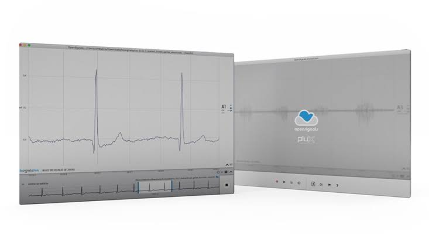 |
| Electrodos descartables | 6 | 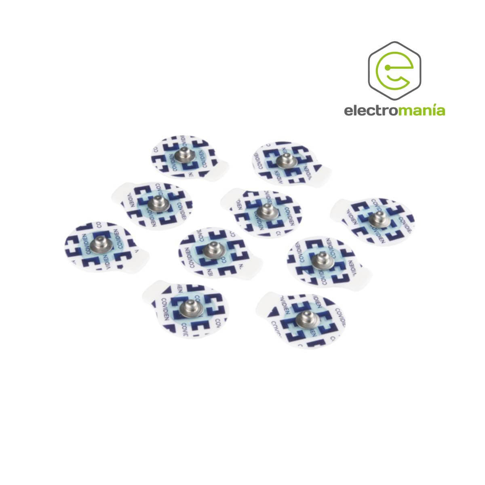 |
| BITalino (r)evolution | 1 | 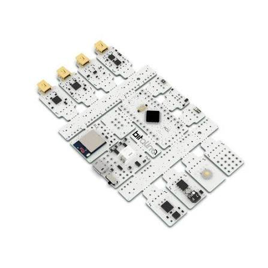 |
| Cable de 3 electrodos | 1 |  |
| Laptop | 1 |  |

## **4. Metodología**
### **4.1 Uso de FFT e identificación de bandas EEG**

## **5. Resultados**

### **5.1 Basal**

#### **5.1.1 Sujeto 1**

Se registró la señal EEG del Sujeto 1 en condición basal (reposo) durante ~120 s. Se aplicó un filtro notch (60 Hz) y un filtro pasa-banda de 0.5–45 Hz, y se calculó la densidad espectral de potencia (PSD), la potencia relativa por banda y el espectrograma.

| | Señal cruda | Señal filtrada |
|:--|:--:|:--:|
| Tiempo | 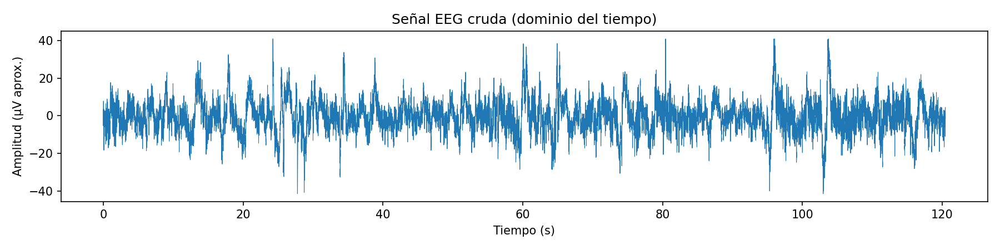 |  |
| PSD | 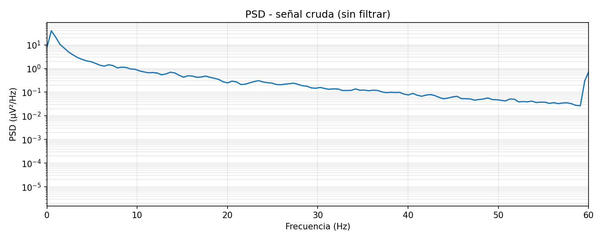 |  |

| Potencia relativa por banda | Espectrograma |
|:--:|:--:|
| 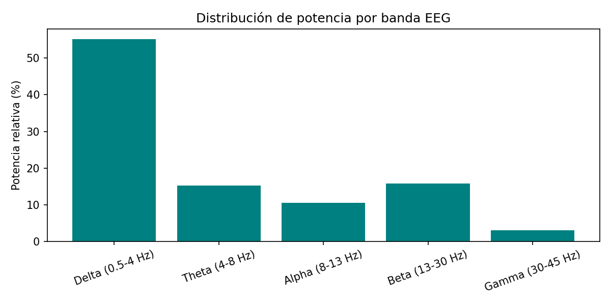 | 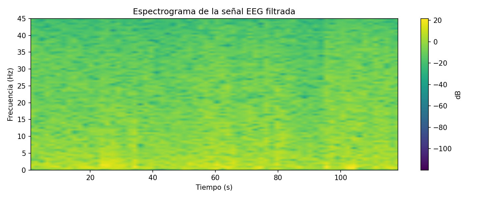 |

**Análisis – Sujeto 1**

- **Dominio del tiempo:** la señal oscila mayormente entre ±20 µV. Se observan picos aislados de mayor amplitud (cerca de 24, 34, 60, 65, 96 y 104 s), algunos llegan a ~±40 µV. Por su forma breve y su amplitud, son compatibles con parpadeos u otros artefactos, no con actividad cerebral. Tras el filtrado estos picos se mantienen, aunque más estrechos, porque su contenido cae dentro de la banda 0.5–45 Hz.
- **PSD cruda:** la potencia es máxima por debajo de ~1 Hz y decae progresivamente con la frecuencia. Hay un aumento brusco en 60 Hz, que corresponde a la interferencia de la red eléctrica. Se ven pequeñas elevaciones alrededor de ~7 Hz y ~14 Hz, pero son leves y no permiten afirmar un ritmo dominante.
- **PSD filtrada:** desaparece la componente de 60 Hz y se atenúa lo que está por debajo de 0.5 Hz. No se aprecia un pico alpha claro.
- **Potencia relativa por banda (valores leídos de la gráfica, aproximados):** Delta ≈ 55 %, Theta ≈ 15 %, Alpha ≈ 10.5 %, Beta ≈ 16 %, Gamma ≈ 3 %.
- **Espectrograma:** la energía se concentra en 0–5 Hz durante todo el registro, con zonas más intensas cerca de ~25 s y ~100–105 s, que coinciden con los picos de la señal temporal.

**Interpretación – Sujeto 1**

- **Delta es la banda con mayor potencia relativa.** En una persona despierta y en reposo esto no indica sueño profundo. Se explica mejor por: (1) los artefactos oculares y de movimiento, que concentran su energía en frecuencias bajas, y (2) la forma natural del espectro EEG, cuya potencia disminuye a medida que aumenta la frecuencia.
- Theta, alpha y beta tienen porcentajes similares entre sí (≈ 10–16 %), lo que sugiere un estado de vigilia sin un ritmo claramente dominante.
- No se observa un pico alpha marcado. Esto es esperable si el registro se hizo con los ojos abiertos o si el electrodo no estaba sobre la región occipital, donde alpha es más visible.
- Este registro sirve como **línea base** para comparar con las demás actividades (ojos abiertos/cerrados, preguntas y canciones).

> **Limitaciones (Sujeto 1):** la amplitud está en µV aproximados (depende de la conversión usada en el procesamiento); los porcentajes por banda se leyeron de la gráfica y no de valores numéricos exportados; y los artefactos no se eliminaron, por lo que inflan la potencia de las bandas bajas.

#### **5.1.2 Sujeto 2**

Se registró la señal EEG del Sujeto 2 en condición basal (reposo) durante ~165 s, con el mismo procesamiento: filtro notch (60 Hz) y pasa-banda de 0.5–45 Hz.

| | Señal cruda | Señal filtrada |
|:--|:--:|:--:|
| Tiempo | 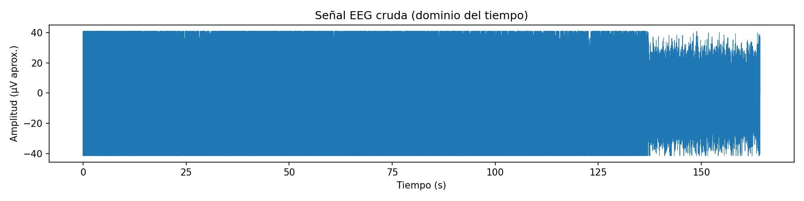 | 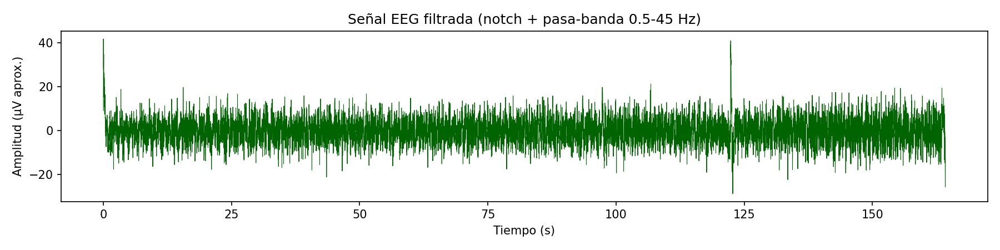 |
| PSD | 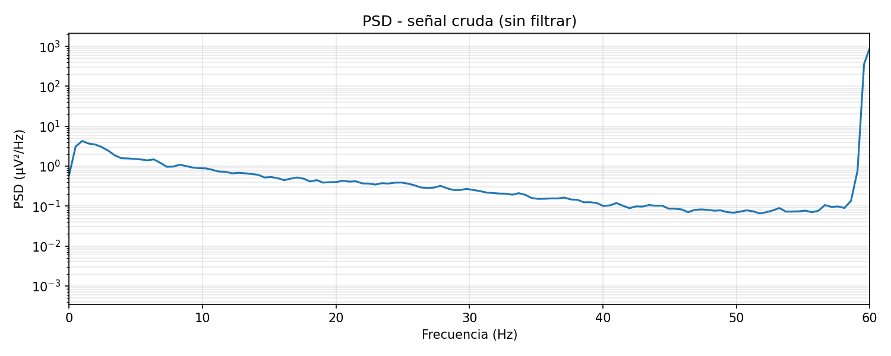 | 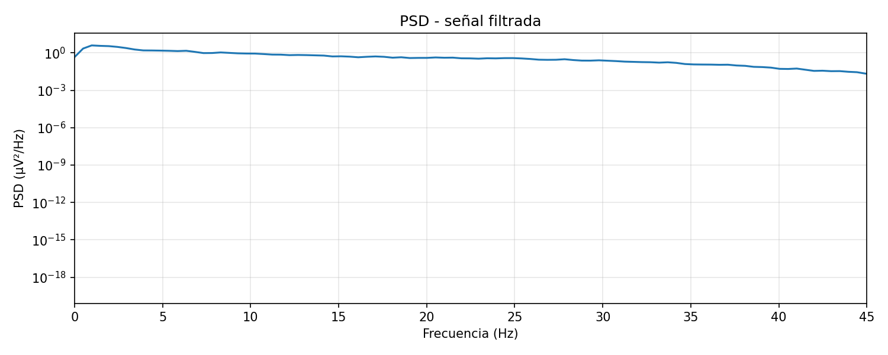 |

| Potencia relativa por banda | Espectrograma |
|:--:|:--:|
| 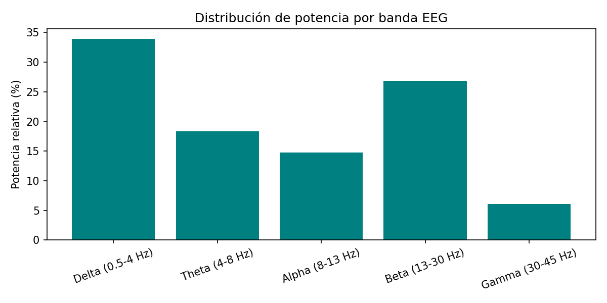 | 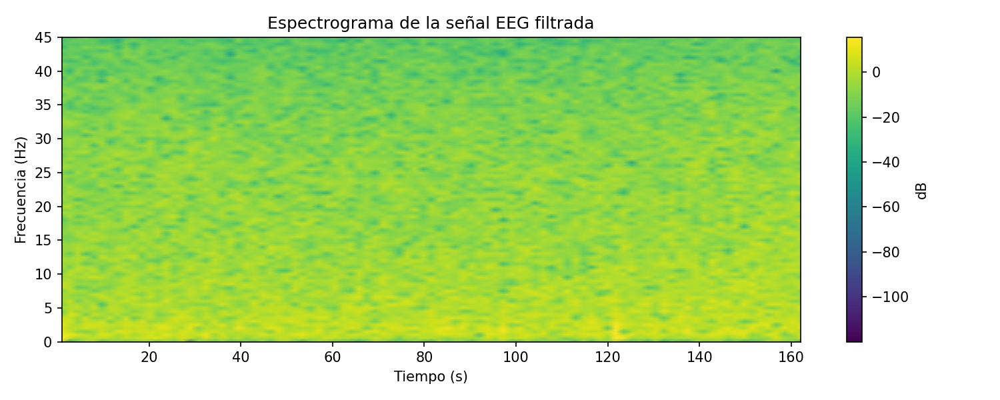 |

**Análisis – Sujeto 2**

- **Señal cruda:** desde el inicio hasta ~137 s la señal ocupa todo el rango de ±41 µV y aparece recortada en ambos extremos (saturación). Entre ~137 y ~165 s la amplitud baja un poco, pero sigue cerca del límite. A esta escala no se distingue ninguna forma de onda EEG: la señal está dominada por ruido de alta amplitud.
- **PSD cruda:** confirma el origen del ruido. El pico en 60 Hz llega a ~10³ µV²/Hz, unas 1000 veces más que la potencia en el resto del espectro (~10⁰–10⁻¹ µV²/Hz). Es decir, la interferencia de la red eléctrica es mucho mayor que en el Sujeto 1. Fuera de los 60 Hz, el espectro decae suavemente con la frecuencia, sin picos claros.
- **Señal filtrada:** tras el notch y el pasa-banda, la señal queda mayormente entre ±15 µV. Se observan dos eventos: un transitorio al inicio (~0 s, hasta ~40 µV), que probablemente es el efecto de arranque del filtro; y un pico aislado cerca de ~122 s (de ~+40 a ~−29 µV), compatible con un artefacto (parpadeo o movimiento). Entre ~140 y ~165 s la amplitud aumenta ligeramente.
- **PSD filtrada:** se elimina la componente de 60 Hz. El espectro es relativamente plano entre ~1 y ~30 Hz y cae hacia 45 Hz. No hay un pico alpha visible.
- **Potencia relativa por banda (valores leídos de la gráfica, aproximados):** Delta ≈ 34 %, Theta ≈ 18 %, Alpha ≈ 15 %, Beta ≈ 27 %, Gamma ≈ 6 %.
- **Espectrograma:** la energía se concentra en 0–5 Hz, con una zona más intensa cerca de ~120 s que coincide con el artefacto de la señal temporal. El resto del registro es bastante homogéneo.

**Interpretación – Sujeto 2**

- La distribución de potencia es **más repartida** que en el Sujeto 1: delta sigue siendo la banda mayor, pero beta (≈ 27 %) se acerca bastante.
- Hay que interpretar este resultado con cautela, porque la señal cruda estuvo saturada casi todo el registro. Cuando una señal se recorta, se pierde parte de la información original. Además, el recorte puede generar componentes de frecuencia que no son actividad cerebral. Por eso, **no es seguro que el aumento de beta y gamma refleje un estado de mayor alerta**. También podría deberse, en parte, al ruido residual o a actividad muscular. Con estos datos no se puede distinguir entre estas causas.
- La interferencia tan alta en 60 Hz suele relacionarse con un mal contacto entre electrodo y piel o con cables cerca de fuentes eléctricas. Esto es una posible explicación y no se verificó durante el registro.

#### **5.1.3 Comparación entre sujetos**

| Banda | Sujeto 1 (%) | Sujeto 2 (%) |
|:------|:-----------:|:-----------:|
| Delta (0.5–4 Hz) | ≈ 55 | ≈ 34 |
| Theta (4–8 Hz) | ≈ 15 | ≈ 18 |
| Alpha (8–13 Hz) | ≈ 10.5 | ≈ 15 |
| Beta (13–30 Hz) | ≈ 16 | ≈ 27 |
| Gamma (30–45 Hz) | ≈ 3 | ≈ 6 |

*Valores aproximados, leídos de las gráficas de potencia relativa.*

- En ambos sujetos **delta es la banda con mayor potencia** y en ninguno aparece un pico alpha claro.
- El Sujeto 1 tiene más potencia en bandas bajas, asociada a artefactos oculares. El Sujeto 2 tiene más potencia en bandas altas (beta y gamma), en un registro con mucha más interferencia.
- La calidad de los registros es distinta: el Sujeto 1 tiene artefactos puntuales, mientras que el Sujeto 2 presenta saturación casi continua. Por eso, **las diferencias entre sujetos no pueden atribuirse con seguridad a diferencias en su actividad cerebral**. Para usarlos como línea base, el registro del Sujeto 1 es más confiable.

> **Limitaciones:** la amplitud está en µV aproximados (depende de la conversión usada en el procesamiento); los porcentajes se leyeron de las gráficas; los artefactos no se eliminaron; y en el Sujeto 2 la saturación impide conocer la amplitud real de la señal en la mayor parte del registro.

## **6. Cuestionario**

### **Q1. ¿Cuáles son las frecuencias relevantes del EEG y en qué se diferencian según la región del cerebro?**

Las frecuencias relevantes del EEG de superficie se encuentran aproximadamente entre **0.5 y 45 Hz** y se agrupan en las bandas delta, theta, alpha, beta y gamma (ver tabla de la sección 1.1). Por encima de ~45 Hz la señal cerebral es muy pequeña y se mezcla con actividad muscular y con la interferencia de la red (60 Hz), por eso en este laboratorio se filtró hasta 45 Hz.

Cada banda no aparece con la misma intensidad en todo el cuero cabelludo:

- **Región occipital y parietal (posterior):** es donde predomina el **ritmo alpha**, sobre todo con los ojos cerrados y en reposo. Al abrir los ojos o prestar atención visual, alpha disminuye (Berger, 1929; Schomer & Lopes da Silva, 2018).
- **Región central (sensoriomotora):** aparece el **ritmo mu** (8–13 Hz), que se reduce cuando la persona mueve o imagina mover una extremidad. También hay actividad **beta** asociada al control motor (Pfurtscheller & Lopes da Silva, 1999).
- **Región frontal:** suele mostrar más **beta** durante la concentración y **theta de línea media** durante tareas de memoria o carga cognitiva (Klimesch, 1999). En electrodos frontopolares (FP1/FP2) también se registran con facilidad artefactos oculares, que aparecen como actividad de baja frecuencia (delta).
- **Delta** en adultos sanos aparece sobre todo durante el sueño profundo; en vigilia su presencia elevada suele indicar artefactos.
- **Gamma** está más distribuida y es difícil de medir en superficie porque se confunde con la actividad muscular.

En los registros basales de ambos sujetos predominó delta y no se observó un pico alpha claro. Esto es coherente con registros que no se hicieron sobre la región occipital y que incluyen artefactos.

## **7. Referencias**

- Berger, H. (1929). Über das Elektrenkephalogramm des Menschen. *Archiv für Psychiatrie und Nervenkrankheiten, 87*, 527–570.
- Klimesch, W. (1999). EEG alpha and theta oscillations reflect cognitive and memory performance: A review and analysis. *Brain Research Reviews, 29*(2–3), 169–195. https://doi.org/10.1016/S0165-0173(98)00056-3
- Pfurtscheller, G., & Lopes da Silva, F. H. (1999). Event-related EEG/MEG synchronization and desynchronization: Basic principles. *Clinical Neurophysiology, 110*(11), 1842–1857. https://doi.org/10.1016/S1388-2457(99)00141-8
- Schomer, D. L., & Lopes da Silva, F. H. (Eds.). (2018). *Niedermeyer's electroencephalography: Basic principles, clinical applications, and related fields* (7th ed.). Oxford University Press.
