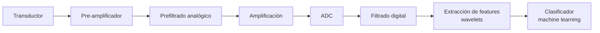

## Extracción de características para ECG
### 1.1 Cadena de procesamiento

```mermaid
flowchart LR
    A[Transductor] --> B[Pre-amplificador]
    B --> C[Prefiltrado analógico]
    C --> D[Amplificación]
    D --> E[ADC]
    E --> F[Filtrado digital]
    F --> G[Extracción de features<br/>wavelets]
    G --> H[Clasificador<br/>machine learning]
```

