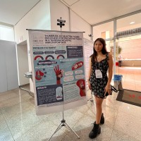
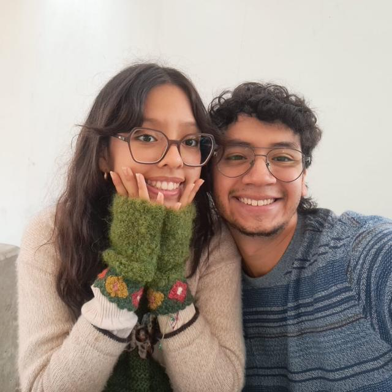

# Introducción a Señales Biomédicas 2026 - II

-----------------------------------------

### Repositorio del Grupo X

**Ingeniería Biomédica PUCP–UPCH**

---

## Descripción del repositorio

Bienvenidos al repositorio del **Grupo X** del curso **Introducción a Señales Biomédicas 2026-II**.

Este espacio ha sido creado para organizar y documentar las actividades desarrolladas durante el curso. Aquí se encontrarán los certificados del programa CITI, los informes y archivos de los laboratorios, así como el desarrollo del hardware y software correspondiente al proyecto del curso.

---

## ¿Quiénes somos?

Somos un equipo conformado por cinco estudiantes de séptimo ciclo de la carrera de **Ingeniería Biomédica PUCP–UPCH**. Compartimos el interés por el estudio, adquisición, procesamiento y análisis de señales biomédicas, así como por su aplicación en el desarrollo de tecnologías orientadas a la salud.

Nuestro objetivo es aplicar los conocimientos adquiridos durante el curso mediante el trabajo colaborativo, la experimentación y el desarrollo de soluciones de ingeniería biomédica.

---

## Integrantes
| Foto | Integrante | Presentación | Contacto |
|:---:|:---|:---|:---:|
| ( | **Adriana Quispe** | Estudiante de séptimo ciclo de Ingeniería Biomédica PUCP–UPCH. Interesada en el procesamiento de señales biomédicas y el desarrollo de tecnologías aplicadas a la salud. | [Correo institucional](mailto:adriana.quispe@upch.pe) |
|  | **Lucas Mendoza** | Estudiante de séptimo ciclo de Ingeniería Biomédica PUCP–UPCH. Interesado en el análisis de señales y las aplicaciones de la ingeniería en el ámbito clínico. | [Correo institucional](mailto:lucas.mendoza.r@upch.pe) |
|  | **Lenna Guevara** | Estudiante de séptimo ciclo de Ingeniería Biomédica PUCP–UPCH. Interesada en el uso de herramientas tecnológicas para el estudio de sistemas biológicos. | [Correo institucional](mailto:lenna.guevara@upch.pe) |
|  | **Claudia Casanova** | Estudiante de séptimo ciclo de Ingeniería Biomédica PUCP–UPCH. Interesada en la investigación y el desarrollo de soluciones para el área de la salud. | [Correo institucional](mailto:adriana.quispe@upch.pe) |
|  | **Rolando Yantas** | Estudiante de séptimo ciclo de Ingeniería Biomédica PUCP–UPCH. Interesado en la instrumentación biomédica y el procesamiento de señales fisiológicas. | [Correo institucional](mailto:adriana.quispe@upch.pe) |

---